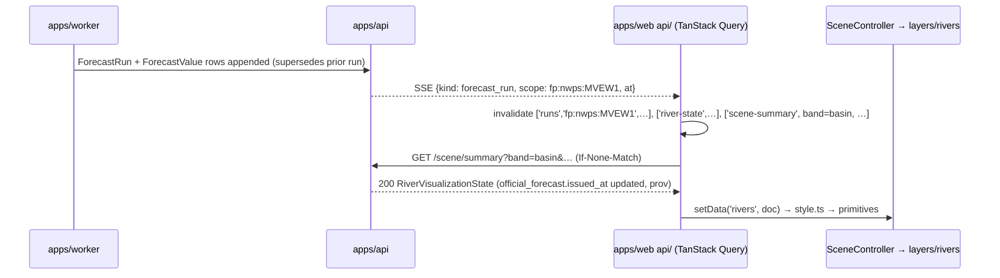

# CINEMATIC ARCHITECTURE — the renderer over the science

Canonical as of 2026-08-22. Scope: `apps/web` and the contract surface it consumes. The product
thesis is "the world is the interface": a planetary-scale 3D scene is the primary navigation
and display surface, and every intelligence panel is anchored to something in it. The
architectural thesis is narrower and non-negotiable: **the backend computes the hydrology; the
client decides how it looks.** Claims follow [CONTEXT.md](CONTEXT.md) conventions
(FACT / ASSUMPTION / INFERENCE / OPEN QUESTION).

Companions: [VISUALIZATION_CONTRACTS.md](VISUALIZATION_CONTRACTS.md) (what arrives),
[VISUAL_TRUTH_DOCTRINE.md](VISUAL_TRUTH_DOCTRINE.md) (what may be shown as what),
[SEMANTIC_ZOOM.md](SEMANTIC_ZOOM.md), [CAMERA_SYSTEM.md](CAMERA_SYSTEM.md),
[LAYER_SYSTEM.md](LAYER_SYSTEM.md), [PERFORMANCE.md](PERFORMANCE.md),
[CINEMATIC_ROADMAP.md](CINEMATIC_ROADMAP.md); decisions [ADR-0006](adr/ADR-0006-web-stack-vite-react-typescript-cesium.md)
and [ADR-0007](adr/ADR-0007-renderer-boundary-and-visualization-contracts.md); boundary rules
with code examples in [cesium-react-boundary.md](../.claude/skills/react-quality/references/cesium-react-boundary.md).
Source facts and the Event Zero record: [DATA_SOURCES.md](DATA_SOURCES.md), [EVENT_ZERO.md](EVENT_ZERO.md).

## 1. Renderer architecture

```
┌──────────────────────────────────────────────────────────────────────────────┐
│ React + TypeScript application shell                                          │
│   intelligence panels · timeline UI · search · layer inspector · settings     │
│   SceneController orchestration (plain TS classes held in refs; not React)   │
├──────────────────────────────────────────────────────────────────────────────┤
│ CesiumJS — the renderer                                                       │
│   globe · imagery · terrain · 3D Tiles · camera · scene clock · picking       │
├──────────────────────────────────────────────────────────────────────────────┤
│ Cascade visualization layers  (apps/web/src/layers/<domain>)                 │
│   vectors: basins, reaches, stations, reservoirs, dams, levees, alerts        │
│   rasters: QPF/QPE, SWE/SCA, soil, freezing level, IVT                        │
│   volumes/fields: snow-level surface, AR corridor (class B values; VTD §3.2)  │
│   cinematic: atmosphere, lighting, shimmer (labeled cinematic, driver named)  │
│   each: contract in (setData) → presentation out (style.ts)                  │
├──────────────────────────────────────────────────────────────────────────────┤
│ Backend scene-state data                                                      │
│   semantic contracts · series · vector/raster/3D tiles · object storage      │
│   VISUALIZATION_CONTRACTS.md · ARCHITECTURE.md §6                             │
└──────────────────────────────────────────────────────────────────────────────┘
```

The shell hosts and orchestrates. Cesium is the canvas: it draws terrain, imagery and
primitives and owns the camera. The Cascade layers are our code that projects backend
contracts onto that canvas. The backend is the only source of scientific state.

**Cesium is a renderer, not a domain framework.** No module in `packages/*`, `apps/api` or
`apps/worker` references it; no contract field is named for it. Replacing the renderer touches
`scene/`, `camera/`, and the bodies of `layers/*/Layer.ts` + `layers/*/style.ts` — not
hydrology, forecasting, ingestion, state, risk assessment, replay, provenance, persistence, the
contracts, `state/`, `api/`, `panels/`, or timeline math. ADR-0006 records MapLibre as a
candidate renderer for the LOW tier and Unreal as a second client; §16 is the proof.

## 2. The Cesium boundary

| Owner | Concern |
|---|---|
| **Backend** (`packages/*`, `apps/api`) | observations, normalization, history, basin state, susceptibility, forcing, forecast intelligence, derived features, thresholds, model agreement, provenance, uncertainty, time series, replay (`as_known_at`), scene-relevant geo metadata (display LOD geometries, `label_priority`, `tile_url_template`, bbox, hypsometry-derived fractions) |
| **Frontend** (`apps/web`) | camera, visual representation, interpolation for animation, shaders, transitions, labels, layer visibility, semantic zoom, interaction, visual encoding, animation timing, temporary client state (hover, drag, panel layout) |

Cesium never sees a raw observation, a threshold, or a method. It sees primitives that a layer
built from a contract item, keyed by the item's stable id (`basin:skagit`, `fp:nwps:MVEW1`,
`station:usgs:12200500`, `reach:nwm:24270288`).

```ts
// BAD — must never exist anywhere under apps/web. Science and colour decided in the browser.
const qpe = await fetch(`/stations/${gaugeId}/series?variable=precip_24h`).then(r => r.json())
const swe = await fetch(`/stations/${snotelId}/series?variable=swe`).then(r => r.json())
const susceptibility = qpe.total_mm > 50 && swe.latest_mm > 200 ? 'high' : 'low'   // invented method
basinPrimitive.color = susceptibility === 'high' ? RED : GREEN                      // colour from raw data
```

```ts
// GOOD — backend computes; frontend maps semantic state to presentation.
// packages/hydrology → Assessment(surface=susceptibility) → packages/visualization →
// GET /scene/summary?band=basin&bbox=…&t=…  →  BasinVisualizationState
//   items[0].surfaces.susceptibility = { state: "high", confidence: "moderate", prov: "p7",
//                                        truth: "cascade_derived", experimental: true }

// apps/web/src/layers/basins/style.ts — the only file where a basin colour is chosen
export function basinFill(s: SusceptibilityState, ctx: StyleContext): FillStyle { /* … */ }

// apps/web/src/layers/basins/BasinLayer.ts
setData(doc: BasinVisualizationState): void {
  for (const item of doc.items) {
    this.upsert(item.id, basinFill(item.surfaces.susceptibility.state, this.styleContext(item)))
    this.badge(item.id, doc.provenance_refs[item.surfaces.susceptibility.prov])   // provenance travels with the primitive
  }
}
```

Interpolation rule: the client may tween *presentation* between two backend states (a fill
fading over 400 ms, a river glow ramping between two valid times). It never interpolates
*science*: no value is invented at 09:30 between the 09:00 and 10:00 observations and shown as
observed. Frames between backend slices carry `VisualTruthClass = cinematic` in the layer
inspector. Flow width/glow derived from `flow_visual_intensity` is a display hint, never a
water-surface extent (HYDROLOGY.md §13 forbids inundation claims without an authoritative model).

## 3. The React boundary

React orchestrates; it is never the graphics engine. Two state worlds exist and meet in exactly
one module:

```
 React world — Zustand store + TanStack Query          Renderer world — plain TS controllers
 semantic, low-frequency (≤ a few Hz)                  high-frequency (per frame, per camera tick)
 selectedEntityId · time · asOf · activeLayers         camera pose · tween progress · primitive handles
 qualityTier · altitudeBand · panel layout             tile loading · hover pick · shader uniforms · clock
            │  scene/bridge.ts: store.subscribe → controller.method()
            │
            ▼                       ▲  quantized events only: bandChanged · settled · picked(id) · layerDegraded(id)
```

Rules (expanded with code in the boundary reference):

1. **No per-frame React re-render of geospatial primitives.** A camera-move event fires at
   frame rate; it never calls a React setter. `CameraController` quantizes height above terrain
   (pitch-corrected, with hysteresis — SEMANTIC_ZOOM.md §1) into a band and emits only on band
   change. Primitives are created, updated and disposed imperatively by
   layers; no primitive is a React element, no React component renders per frame.
2. **No Cesium types in application state or props.** Stores and components carry
   `EntityId`, `IsoUtc`, `LayerId`, `QualityTier` — never an entity handle, a cartesian, or a
   material. `scene/bridge.ts` (store subscriptions, installed once by `<Scene/>`; never a
   per-component `useEffect`) bridges state → controller; controllers never write to the store
   except through the quantized event channel.
3. **One `<Scene/>` component**, which mounts `SceneController` into a ref on first render,
   disposes it on unmount, and renders nothing else. Panels, timeline, search and inspector are
   ordinary React trees that read the store and the query cache and call controller methods.
4. **Failure isolation.** Panel trees sit inside error boundaries; the scene does not, because
   a boundary that remounts the viewer destroys renderer state. A throwing layer is unmounted
   by `SceneController` and shown as `degraded` in the layer inspector.
5. **No science in components** (V1 computed a 24 h trend in `RiverGaugeCard`; V1_AUDIT.md §3L).
   Trend, headroom, anomaly, agreement and "why" text arrive in contracts.

```ts
// BAD — 60 Hz React state                       // GOOD — quantized, one subscription
camera.onChange(() => setAltitude(camera.height))   cameraController.onBandChange(b => store.getState().setAltitudeBand(b))
```

## 4. Scene-state architecture

### 4.1 Controllers (plain TypeScript, owned by `scene/`, `camera/`, `timeline/`)

| Controller | Owns | Input | Emits |
|---|---|---|---|
| `SceneController` | viewer lifecycle, layer registry, selection, degrade/restore | `select(id)`, `setTime(t)`, `setLayerVisible(id, b)`, `setData(layerId, doc)`, `setQuality(tier)` | `picked(id)`, `layerDegraded(id, reason)` |
| `CameraController` | flights, orbit, follow, framing; reduced-motion cut path | `flyTo(target, opts)`, `frame(entityId)`, `orbit(…)` | `cameraSample` (≤ 10 Hz while moving, plus on settle), `settled`, `interrupted` |
| `SemanticZoomController` | derives the band from `cameraSample` with hysteresis (SEMANTIC_ZOOM.md §5) and emits `bandChanged`; then band → meaning: layer visibility, LOD and label set per band (`orbital/state/basin/river/local`, plus the client-only `ground` band that requests `band=local` — SEMANTIC_ZOOM.md §1, OQ-1) | `bandChange` (band math with hysteresis lives in `camera/`, §3 rule 1; ownership OPEN QUESTION §17) | `lodChange(layerId, lod)`, `layerVisibilityChanged`; the band written to the store selects which `SceneSummary` band `api/` requests |
| `TimelineController` / `PlaybackEngine` | play/pause/scrub/rate; window `[now−72h, now+120h]` or `[T−72h, T+120h]` in replay | user intent | writes `time` to the store at a bounded rate (≤ 10 Hz during playback; ASSUMPTION, tune in PERFORMANCE.md) |
| `SceneClock` | adapter from store `time` to the renderer's clock, used for solar lighting only; layers take time from `setTime`, never from the renderer clock (LAYER_SYSTEM.md §2.1) | `time` | nothing; the renderer clock never writes back |
| `scene/bridge.ts` | the only module subscribing the store to controllers | store changes | controller calls |

Zustand holds **client semantic state** (selection, time, `asOf`, active layers, quality tier,
altitude band, panel layout). TanStack Query holds **server state** keyed by
`(contract, entity, time bucket, band, extent key, asOf, layer set)`, with ETags on geography,
`staleTime` derived from each product's cadence, and an `AbortSignal` per key so that a band or
time change cancels in-flight work. Components never fetch directly.

### 4.2 The declarative SceneState

```ts
// Conceptual shape assembled on the client from many cached documents. It is a *view* over the
// store and the query cache — it is never fetched, serialized, or diffed as one object.
interface SceneState {
  time: { valid: IsoUtc; mode: 'past' | 'now' | 'forecast'; asOf: IsoUtc | null; playback: 'paused' | 'playing'; rate: number }
  selection: { regionId: RegionId | null; basinId: BasinId | null; entityId: EntityId | null }   // e.g. 'region:cascadia', 'basin:skagit', 'fp:nwps:MVEW1'
  camera: { band: CameraBand; extentKey: string; reducedMotion: boolean }
  basins: Record<BasinId, BasinItem>            // BasinVisualizationState.items
  rivers: Record<EntityId, RiverVisualizationState>
  reservoirs: Record<EntityId, ReservoirVisualizationState>
  snow: Record<BasinId, SnowVisualizationState>
  soil: Record<BasinId, SoilDrivers>            // today: susceptibility headline_drivers; see OPEN QUESTION §17
  weather: WeatherVisualizationState | null     // precipitation / forecast fields, AR
  hazard: HazardVisualizationState | null       // cross-basin summary for orbital/state bands
  alerts: OfficialAlert[]                       // verbatim, badged OFFICIAL
  layers: { available: LayerId[]; active: LayerId[]; degraded: Record<LayerId, string> }
  provenance: Record<ProvRef, ProvenanceRef>    // merged provenance_refs; inspector reads here
  // confidence and freshness are per item (ConfidenceLabel, Freshness), never a scene-wide scalar
  quality: 'ultra' | 'high' | 'balanced' | 'low'
}
```

### 4.3 Why SceneState is not transmitted as one object per frame

- **Scale.** The orbital band needs `HazardVisualizationState` for six basins; the local band
  needs one reach's series and one station's thresholds. One document cannot serve both.
- **Type.** Rasters are tiles, not JSON; series are cursor-paginated; geography is static with
  ETags. Each has its own transport (§6).
- **Cadence.** Geography changes per dataset release; observations every 15 min; forecasts per
  cycle; the camera every frame. A single object would be invalidated by its fastest member.
- **Caching.** Scale- and type-specific endpoints cache independently; a new forecast run
  invalidates `['runs', lid]` and the affected `['scene-summary', …]` keys, nothing else.
- **Subscriptions.** SSE (§5) names a `kind` and `scope`; invalidation is surgical.

VISUALIZATION_CONTRACTS.md §8 states the backend half of this rule: `SceneSummary` returns
the subset of contracts appropriate to the band, "never one monolithic scene object".

```
query keys (api/keys.ts)
['scene-summary', band, extentKey, tBucket, asOf, layersKey]   staleTime: product cadence
['basin-state', basinId, asOf]                                  invalidated by SSE kind=assessment
['river-state', fpId, asOf]                                     invalidated by SSE kind=observation|forecast_run
['series', stationId, variable, from, to, asOf]                 cursor-paginated
['runs', lid, asOf]  ·  ['run-values', lid, runId]               forecast evolution
['geo', 'basins', lod]  ·  ['geo', 'reaches', lod]               ETag; staleTime: Infinity
['config', 'public']                                            keys, provider list, CSP hosts (§13)
```

### 4.4 The wrong contract and the correct one

```jsonc
// WRONG — renderer concepts in a backend document (violates VISUALIZATION_CONTRACTS.md §10 rule 2)
{ "id": "basin:skagit", "surface": "hazard", "cesiumColor": "#FF3B30", "pulse": true, "cameraHint": "flyTo", "opacity": 0.8 }

// CORRECT — BasinVisualizationState.surfaces.hazard; state, severity and confidence only
{ "horizon_h": 72, "official_category": "minor", "official_prov": "p1",
  "model_probability": { "model": "nwm-mr-ens", "exceeds": "minor", "fraction": 0.43 },
  "cascade_index": null, "truth": "authoritative_model" }
// apps/web/src/layers/basins/style.ts maps (official_category × truth × freshness.state × selected × tier)
// to fill, outline, label treatment and motion. The backend never learns what that mapping is.
```

## 5. Backend integration

The client consumes the API families of ARCHITECTURE.md §6 as follows:

| Family | Endpoints used | Client consumer |
|---|---|---|
| geography | `/basins`, `/basins/{id}`, `/basins/{id}/reaches`, `/stations/{id}`, `/reservoirs/{id}`, `/search?q=` | `entities/`, search, tile join keys |
| state | `/basins/{id}/state`, `/stations/{id}/state`, `/reservoirs/{id}/state` | panels, inspector |
| assessments | `/basins/{id}/assessments?surface=&horizon=`, `/assessments/latest`, `/basins/{id}/explanation` | basin layer (via scene summary), explanation panel |
| series | `/stations/{id}/series?…`, `/forecast-points/{lid}/runs`, `/forecast-points/{lid}/runs/{run}/values` | hydrograph panel, river layer time slices, forecast evolution |
| thresholds & alerts | `/forecast-points/{lid}/thresholds`, `/alerts?basin=` | threshold bands on hydrographs, alert layer |
| replay | any read endpoint with `?as_of=<T>` | every query when `asOf` is set |
| visualization | `/scene/summary?bbox=&band=&t=&as_of=&layers[]=`, `/viz/basins?t=`, `/viz/rivers?t=`, tile redirects | `SceneController.setData` fan-out |
| system | `/system/health`, `/system/sources`, `/system/freshness` | layer inspector, degraded banners |
| events | `/events`, `/events/{id}/timeline`, `/events/{id}/hindcasts` | Event Mode, replay bookmarks |

`SceneSummary` is the workhorse: one request per (band, extent, time bucket) returns the
contracts that band needs, each with its own `provenance_refs`; `SceneController` fans the
response out to layers by contract name.

**Live updates: notify, then fetch.** The API exposes one SSE topic per basin emitting
`{kind: observation|forecast_run|assessment|alert, scope, at}` with no payload. The client
maps `kind`+`scope` to query keys, invalidates, and refetches through the normal HTTP path
(cacheable, ETagged, abortable). In replay (`asOf` set) the client unsubscribes: the past is
served by `as_known_at(T)` and does not move.



**No raster datasets over WebSockets or SSE.** Streams carry invalidation only. Rasters are
tiles over HTTP because they must be range-requestable, CDN-cacheable and abortable per tile.

## 6. Geospatial delivery by type

| Data | Transport / format | Consumer | Cache |
|---|---|---|---|
| entity metadata, current state, assessments, provenance, alerts, explanation | REST/JSON | TanStack Query → panels, layers | ETag; `staleTime` = product cadence |
| observations, forecast trajectories, replay slices | time-series endpoints, cursor-paginated JSON | hydrograph panel, river layer `setTime` | per `(scope, variable, window, asOf)` |
| basins, reaches, stations, dams, reservoirs, flood defenses | vector tiles (PMTiles/MVT) per LOD, joined client-side to contract items by stable id | vector layers | immutable per dataset release |
| precipitation, snow (SWE/SCA), soil, weather fields (freezing level, IVT, temperature) | raster tile service over COGs; `raster_ref.tile_url_template` + `display_range` from Weather/Snow states | raster layers | CDN; keyed by `(product, issued_at, valid_time, variable, z/x/y)` |
| photogrammetry, LiDAR point clouds, local detail | 3D Tiles | local band, HIGH/ULTRA only | CDN; optional |
| GRIB, NetCDF, large COG, historical archives | object storage (S3 API) | **workers only** | lifecycle rules (DATA_DOCTRINE.md §13) |

Cloud-optimized formats, by role: COG (rasters), vector tiles / PMTiles (geometry), GeoParquet
(bulk analytic exports), 3D Tiles (meshes, point clouds), Zarr (multi-dimensional archives for
workers), NetCDF and GRIB (raw archive, never to the browser), GeoJSON **only when small**
(six basin outlines at state LOD; ASSUMPTION: under ~1 MB gzipped, else tile it).

Renderer note (FACT, `research/rendering-stack-and-geodata-delivery.json`): CesiumJS 1.142+
renders MVT natively through `MVTDataProvider`, which Cesium marks experimental and outside its
deprecation policy. The vector layers therefore keep the option of decoding PMTiles/MVT into
their own primitives (INFERENCE; measured in the C2 phase, CINEMATIC_ROADMAP.md §15 OQ-3). The
choice lives in `layers/*/Layer.ts`, never in a contract or a delivery format.

### 6.1 Backend preprocessing pipeline

```
RAW SOURCE → INGEST → ARCHIVE → NORMALIZE → GEOSPATIAL ALIGNMENT → SCIENTIFIC DERIVATION
           → VISUALIZATION DERIVATIVE → TILE/API DELIVERY → FRONTEND
```

HRRR example (one hourly cycle; host and variable names per [DATA_SOURCES.md](DATA_SOURCES.md)):

| Stage | What happens | Where |
|---|---|---|
| RAW SOURCE | HRRR GRIB2 cycle published by NOAA | external |
| INGEST | scheduled job keyed `(product:hrrr, issued_at)`; idempotent, rate-aware | `apps/worker` |
| ARCHIVE | raw file to object storage at `product/issued/valid/variable`; sha256; `GridProduct` index row | `packages/core`, `packages/providers/hrrr` |
| NORMALIZE | extract total-precipitation and freezing-level-height variables; units → canonical (mm, m); `valid_time`, `issued_at`, `retrieved_at`, `available_at` set | `packages/providers/hrrr` |
| GEOSPATIAL ALIGNMENT | reproject from the model's native grid to the analysis CRS; clip to the Washington extent; align to precomputed basin masks | `packages/geo` |
| SCIENTIFIC DERIVATION | basin-average QPF per window (6/12/24/48/72/120 h); snow level = freezing level − offset parameter (HYDROLOGY.md §7, parameter with provenance); rain-exposed and rain-on-snow exposed fractions via hypsometry ∩ SCA; `DerivedFeature` rows with lineage; forcing `Assessment` | `packages/hydrology` |
| VISUALIZATION DERIVATIVE | per valid time per variable: a COG in the renderer's tiling scheme with `display_range`; tile pyramid; `WeatherVisualizationState.fields[].raster_ref` | `packages/visualization` |
| TILE/API DELIVERY | `/scene/summary` returns field refs and basin aggregates; tiles served via CDN/redirect with cache headers | `apps/api`, object storage |
| FRONTEND | `layers/weather/PrecipitationLayer.setData(doc)` mounts imagery from `tile_url_template`; `setTime(t)` selects the slice; `style.ts` maps `display_range` to a ramp; `prov` feeds the inspector | `apps/web` |

### 6.2 Precomputed on the server, never in the browser

Basin hypsometry; river topology; upstream/downstream graph; terrain statistics; basin masks
per grid definition; QPF basin aggregation; snow/basin intersection; rain-on-snow exposure;
historical percentiles and climatology; tile pyramids; simplified geometries per LOD.

**Rule: the browser never repeats heavyweight raster processing.** It never reprojects a grid,
never computes zonal statistics, never intersects SCA with a snow level, never resamples a DEM.
Client-side pixel work is limited to colour-mapping an already-aligned tile and cinematic
blending between two adjacent slices, and that blend is labeled `cinematic`.

## 7. Temporal architecture

### 7.1 One continuous timeline

```
 ◄──────────── PAST ────────────┤ NOW ├──────────────── FORECAST ────────────────►
 −72 h                          t₀                                          +120 h
 OBSERVED · MODELED analyses          OFFICIAL_FORECAST · MODELED runs (per issued_at)
 mode: past                           mode: forecast          horizons 6/12/24/48/72/120 h
```

The timeline window is `[now − 72 h, now + 120 h]` (`time.mode` = `past | now | forecast`,
matching the contract envelope). One scrubber, one `time` value in the store, every layer
answers `setTime(t)` from data it already holds; a miss is reported to the request scheduler
(`scene/requests.ts`, LAYER_SYSTEM.md §6), which fetches through `api/` and delivers the slice via
`setData` — layers never fetch (§12 import rules).

### 7.2 Three timestamps, never collapsed

`valid_time` (when true), `issued_at` (when the run was produced; null for observations) and
`retrieved_at` (when Cascade Oracle fetched it), plus `available_at` (knowledge time) —
DATA_DOCTRINE.md §3 and §11. Client consequences:

- Every forecast primitive and panel row shows "valid … · issued … by … · fetched …".
- The scrubber labels a forecast tick with the `issued_at` of the run being shown; a
  superseded run remains selectable only in the forecast-evolution view (§7.4; LAYER_SYSTEM.md
  §2.2) and is drawn with a distinct superseded treatment.
- Observed and forecast slices never share a visual encoding, even when they abut at NOW.
- For `t ≤ now`, observed data wins; forecasts issued before `t` for valid times ≤ `now` are
  shown only in the forecast-evolution view (§7.4), never as the default scene state.

### 7.3 Historical replay (backend knowledge time)

Entering replay sets `asOf = T` in the store. The bridge propagates `T` to every query key;
every request carries `?as_of=T`; the backend answers through `as_known_at(T)` (ADR-0010).
The client adds nothing: it cannot see, cache or leak a row with `available_at > T`.

No look-ahead: at historical `T`, the window becomes `[T − 72 h, T + 120 h]`, the NOW marker
sits at `T`, the forecast segment contains only runs with `issued_at ≤ T`, and observations
with `available_at > T` do not exist to the client. SSE is unsubscribed. An explicit
"reveal outcome" overlay may draw what actually happened, fetched **without** `as_of`, in a
hindsight treatment that is never merged into the replay scene state. Event Zero (the December
2025 flood; `event:2025-12-western-wa-ar`; [EVENT_ZERO.md](EVENT_ZERO.md)) is the first replay
target (ROADMAP.md Phase 6).

### 7.4 Forecast-evolution view

For one valid time `V` (e.g. the Skagit at Mount Vernon crest, 2025-12-12 08:15Z at
`fp:nwps:MVEW1`), show every run issued on successive days `D−5 … D` against the observed
outcome: `/forecast-points/MVEW1/runs` → `/runs/{run}/values` for each, plus
`/stations/station:usgs:12200500/series`. The chart is 2D (panel); the scene may echo the
selected run. Spread, timing disagreement and the agreement state come from the backend's
`model_agreement` assessment; the client draws, it does not compute.

Clock ownership: store `time` → `SceneClock` → renderer clock. Tests run with a fixed clock
(TESTING.md §6); no layer reads wall-clock time.

## 8. Layer architecture (summary)

Every layer implements `SceneLayer` — `mount(scene) · unmount() · dispose() · setTime(valid, mode) ·
setVisible(b) · setData(doc) · setQualityTier(tier)` plus status, `provenance()`, `textEquivalent()`
and `budget()`; the canonical signatures are [LAYER_SYSTEM.md](LAYER_SYSTEM.md) §1 and this summary
defers to them — declares its contract type, its `VisualTruthClass`, its LOD per
band and its quality-tier behaviour, and maps semantic state to presentation in one
`style.ts`. Temporal behaviour (slice selection, between-slice blending, superseded treatment)
comes from one shared `TemporalLayer` base, so no layer re-implements time. Domain layers:
basins, rivers, stations, reservoirs, snow, soil, weather (precipitation, freezing level,
IVT/AR), hazard, alerts, infrastructure (dams, levees), terrain/basemap, and a `cinematic`
group (atmosphere, lighting, water shimmer) whose inspector entry says so. Registry, LOD
rules, degrade behaviour and the inspector contract are specified in
[LAYER_SYSTEM.md](LAYER_SYSTEM.md).

## 9. Performance strategy (summary)

Budgets per tier (frame time, tile and primitive counts, memory, bundle size) and the harness
live in [PERFORMANCE.md](PERFORMANCE.md). Commitments here: code-split and lazy-load the
renderer; fetch only the current band's extent with an `AbortSignal` per key; bounded prefetch
(adjacent time slices and one adjacent band, never unlimited); tile decoding off the main
thread; backend LOD geometry; entity budgets per band; quantized camera events; no per-frame
React work; FPS and visual-regression runs on fixed scenes in CI (TESTING.md §1, §6).

## 10. BasemapProvider and TerrainProvider

```ts
interface BasemapProvider {
  id: string                                        // 'osm-keyless' | 'vendor-satellite' | …
  kind: 'satellite' | 'aerial' | 'terrain' | 'orthophoto' | 'natural_colour' | 'low_light_analytical'
  attribution: string                               // always rendered
  usage: { maxZoom: number; maxTileRequestsPerMinute?: number; prefetchAllowed: boolean;
           minCacheSeconds?: number }              // e.g. OSM policy: honour cache headers, cache ≥ 7 days
  cspHosts: string[]                                // feeds the CSP allowlist (§13)
  requiresKey: boolean                              // key comes from /config/public, never the bundle
  createImagery(ctx: RendererContext): ImageryHandle   // renderer-specific inside; generic outside
}
interface TerrainProvider {
  id: string
  level: 'global' | 'regional_dem' | 'wa_product' | 'lidar'
  verticalDatum: string; nominalResolutionM: number
  attribution: string; cspHosts: string[]; requiresKey: boolean
  createTerrain(ctx: RendererContext): TerrainHandle
}
```

- **Keyless default** (FACT, ADR-0006): OSM tiles and ellipsoid terrain. The app runs with no
  account. FACT (OSM tile usage policy, `research/rendering-stack-and-geodata-delivery.json`):
  `tile.openstreetmap.org` is best-effort with no SLA, withdrawable at any time, and requires a
  visible "© OpenStreetMap contributors" credit — so the keyless default serves development and
  demos; the production default basemap is a self-hosted OSM-derived PMTiles set or a
  quota-bearing vendor (PERFORMANCE.md §3; CINEMATIC_ROADMAP.md §15 OQ-2). Higher tiers plug in
  vendor imagery/terrain through public config.
- **Interchangeable vendors.** Satellite, aerial, terrain-shaded, orthophoto, natural-colour and a
  low-light analytical basemap are all `BasemapProvider`s; switching one is a store change, not
  a code change. Attribution, usage limits and caching rules of each provider are encoded in
  the provider object and respected by the layer (no tile scraping, no prefetch beyond what
  `usage` allows).
- **Visual terrain ≠ scientific DEM.** The displayed mesh is a cartographic product
  (`VisualTruthClass = cartographic`) chosen for appearance and performance. Hypsometry, basin
  masks, snow-level intersections and terrain statistics come from the backend's 3DEP-derived
  DEM (ROADMAP.md Phase 0). **Never compute science from the displayed mesh**, and never sample
  it to position a scientific value. When they differ — an ellipsoid at LOW, a vendor mesh at
  ~30 m versus the science DEM at ~10 m (ASSUMPTION for resolutions; record actuals in
  [DATA_SOURCES.md](DATA_SOURCES.md)) — the layer inspector states both: "terrain shown: <provider>, <res>;
  science DEM: 3DEP, <res>, <datum>". A snow-level contour drawn at 2,100 m is the scientific
  elevation; on a coarser visual mesh it may not hug the visible ridgeline, and the inspector
  says why.
- **Progressive terrain hierarchy:** global → regional DEM → Washington products → LiDAR,
  selected by band and tier, each a `TerrainProvider` with its own attribution and datum.
- **Optional high-resolution local enhancement:** photorealistic mesh, LiDAR DSM/point clouds,
  orthophoto/canopy as 3D Tiles or imagery, loaded only in the `local` band at HIGH/ULTRA.
  Never required: every intelligence function works with none of them loaded.

## 11. Quality tiers

| Tier | Terrain | Imagery | 3D Tiles | Raster layers | Cinematic effects | Budget |
|---|---|---|---|---|---|---|
| ULTRA | LiDAR where available | vendor satellite | photogrammetry + point clouds | all, full resolution | all (atmosphere, lighting, volumes) | highest |
| HIGH | WA products | vendor satellite | photogrammetry | all | most | high |
| BALANCED | regional DEM | vendor or production default basemap | none | key fields | restrained | mid |
| LOW | ellipsoid / 2.5D (MapLibre candidate, ADR-0006) | production default basemap (keyless OSM in dev only, §10) | none | one scientific raster at one zoom level lower, basin aggregates always (DECIDED 2026-08-22; PERFORMANCE.md §3) | none; no custom shaders | lowest |

`qualityTier` is store state (`'ultra' | 'high' | 'balanced' | 'low'`), auto-detected and user-
overridable; layers receive it through `SceneController.setQuality`, which fans out to each layer's
`setQualityTier` (PERFORMANCE.md §3). **Rule: core intelligence is
identical on LOW** — panels, timeline, replay, search, selection, provenance badges, freshness,
alerts and the explanation view do not depend on tier. A tier changes what is drawn, never
what is known.

## 12. Frontend package boundaries

```
apps/web/src/
├─ app/            routes, shell layout, providers (query client, store), error boundaries
├─ scene/          SceneController, SemanticZoomController, SceneClock, bridge.ts, requests.ts (RequestScheduler), layer registry
├─ camera/         CameraController, flight presets, band math, reduced-motion paths
├─ layers/         contract.ts (SceneLayer, TemporalLayer), truth.ts, inspector.ts, then one folder per domain:
│   ├─ basins/     BasinLayer.ts · style.ts · state.ts · *.test.ts
│   ├─ rivers/     snow/  soil/  weather/  reservoirs/  hazard/  alerts/  infrastructure/  terrain/  cinematic/
├─ timeline/       TimelineController, PlaybackEngine, window math, tick labeling
├─ entities/       id parsing (basin:, fp:nwps:, station:usgs:, reach:nwm:), lookup, search adapters
├─ panels/         React intelligence panels, hydrographs, explanation, layer inspector
├─ interactions/   pick → select, hover, keyboard paths, gestures (semantic events only)
├─ state/          Zustand store slices (selection, time, layers, quality); no renderer types
├─ api/            query keys, fetchers, SSE → invalidation, `/config/public` loader
├─ contracts/      generated from packages/contracts JSON Schema; never hand-edited
└─ design-system/  tokens, badges (OBSERVED / OFFICIAL FORECAST / MODELED / DERIVED / EXPERIMENTAL / UNKNOWN), motion
```

Import rules, enforced by lint: only `scene/`, `camera/`, `layers/*` import the renderer;
`layers/<domain>` imports `contracts`, `layers/contract.ts`, `design-system/tokens` and its own
folder — never `panels/`, `state/`, `api/`, or another domain layer (data arrives through
`SceneController.setData`); `panels/` and `state/` never import the renderer; `api/` never
imports React components. Nested `AGENTS.md` files exist only where real complexity exists
(`scene/`, `layers/`, `timeline/`), each a pointer to the contract and tests that folder needs.

**Module boundaries are context boundaries.** An agent editing snow visualization needs:
`contracts/SnowVisualizationState`, `layers/contract.ts`, `layers/snow/{SnowLayer,style,state}.ts`
(`SnowVisualizationState` in, `SnowLayerState` inside), and `layers/snow/*.test.ts`. It does not
need database internals, reservoir code, auth, deployment, or the basins layer. If a change
requires reading beyond that set, the boundary is wrong and is fixed first (§15).

## 13. Security and cost notes for the client

- **No secrets in the bundle.** No `VITE_*` variable holds a key; CI greps `dist/` for
  key-shaped strings and fails the build (vibesec addendum §4).
- **Public, domain-restricted keys** (imagery, terrain, 3D Tiles tokens) arrive from a reviewed
  `GET /config/public` endpoint together with the provider list; keys are scoped to the
  deployed origin and rotate server-side.
- **CSP allowlists** for tile, imagery, terrain and 3D Tiles hosts are generated from
  `BasemapProvider.cspHosts` / `TerrainProvider.cspHosts`; a new provider is a config review,
  never an ad hoc header edit. No third-party scripts (V1_AUDIT.md §5 S2).
- **Validate user-controlled geometry and query params** on both sides: the client refuses to
  send a bbox above the documented area limit, a polygon above the vertex limit, or a time
  range above the window; the API rejects rather than clamps (vibesec addendum §3).
- **Instrument** provider tile requests per session, egress bytes, tile generation count and
  latency, object-storage reads, and CDN/tile cache hit rate (ARCHITECTURE.md §8); budgets and
  alerts in PERFORMANCE.md.
- **No unlimited prefetch.** Prefetch is bounded to adjacent time slices and one adjacent band,
  respects `BasemapProvider.usage`, and is cancelled on band or time change.

## 14. Architectural success criteria

| # | Criterion | Proven by |
|---|---|---|
| 1 | The backend operates with no Cesium client | `apps/api` + `apps/worker` integration tests run with no web build |
| 2 | Another client can consume the same science | contract fixtures validate in Python and TypeScript; §16 |
| 3 | Basemap providers are switchable | swapping `BasemapProvider` id in the store changes imagery; E2E |
| 4 | Scientific calculations never depend on renderer state | `packages/*` import-linter forbids web imports; no API param names a camera |
| 5 | Historical scenes are reproducible | golden replay: `as_of=T` scene equals stored fixture (TESTING.md §5) |
| 6 | Every scientific visualization has provenance | missing `prov` is a schema violation; inspector E2E |
| 7 | High-resolution assets are optional | E2E passes with no 3D Tiles and keyless basemap |
| 8 | Low-end devices retain core intelligence | E2E suite runs on `qualityTier=low` |
| 9 | A rendering failure cannot corrupt scientific data | client is read-only; API database role is read-only `api_reader` (vibesec addendum §5); layer degrade test |
| 10 | Camera changes never trigger scientific recomputation | camera events reach only `SemanticZoomController`; no API call computes on request |
| 11 | New scientific layers without renderer redesign | adding `layers/<new>/` touches no existing layer (§12 import rules) |
| 12 | New renderers without hydrology redesign | §1 replaceability list; §16 |
| 13 | Model uncertainty remains visible | spread, `ConfidenceLabel`, agreement state rendered and asserted in visual regression |
| 14 | Cinematic representation never masquerades as observation | `VisualTruthClass` per primitive; inspector lists `cinematic` entries; VISUAL_TRUTH_DOCTRINE.md |

## 15. Refactoring triggers

There is no `CesiumMap.tsx` that holds camera, layers, weather, rivers, selection, timeline,
risk, tooltips, API calls and effects. Refactor immediately when any of these appears:

- layer implementations repeat patterns (time slicing, degrade, LOD) → lift into `TemporalLayer`;
- camera and data concerns mix (a fetch inside a flight, a flight inside a fetcher);
- domain values leak into shader code (a threshold or percentile in a uniform) → the mapping
  belongs in `style.ts`, the science in the backend;
- Cesium types leak through application state or props;
- multiple layers independently implement temporal behaviour;
- one scene controller owns everything (selection + camera + time + quality in one class);
- React starts controlling frame-level rendering (a hook per animation frame, a component
  per primitive);
- backend and renderer contracts entangle (a field named for a colour, a camera, an opacity).

## 16. A future Unreal client

An Unreal client (Cesium for Unreal, deferred per ADR-0006) consumes the same endpoints:
`SceneSummary` per band, the `*VisualizationState` contracts, vector/raster/3D tiles, series and
`as_of` replay, with its own style mapping and controllers. The backend never knows which
client it serves: no user-agent branching, no client-specific field, no camera hint. The test
is literal: the fixtures in `packages/contracts/fixtures/` are the only input both clients need.

## 17. Open questions

- OPEN QUESTION: VISUALIZATION_CONTRACTS.md defines no `SoilVisualizationState`; soil appears
  only through susceptibility `headline_drivers`. A soil layer (ROADMAP.md Phase 3) likely needs
  its own contract; decide before C4.
- DECIDED 2026-08-22 (band derivation): `SemanticZoomController` owns the band. `CameraController`
  publishes `cameraSample` (height above terrain, pitch; ≤ 10 Hz while moving, plus on `settled`);
  the zoom controller applies `deriveBand` with hysteresis (SEMANTIC_ZOOM.md §5) and emits
  `bandChanged`. The camera never emits a band. The pure math lives in `scene/bands.ts`.
- DECIDED 2026-08-22 (`ground` band): the band enum gains `ground` end-to-end — `SemanticBand`,
  `SceneSummary.band` and `GeometryRef.lod` (additive contract bump 1.1.0). Until the API serves
  distinct ground-band content it answers a `ground` request with `local` content and echoes the
  requested band.
- DECIDED 2026-08-22 (query keys): `api/keys.ts` is the single source; the canonical shape is
  `['scene', dataBand, extentKey, tBucket, asOf, layersHash]` as in LAYER_SYSTEM.md §0 and
  SEMANTIC_ZOOM.md §7; §4.3 above is read as that shape.
- DECIDED 2026-08-22 (cinematic effects): they are layers — `layers/cinematic/<name>/` implementing
  `SceneLayer` with `truthClass: cinematic`; there is no `effects/` folder.
- OPEN QUESTION: direct browser range reads of COGs (bypassing the tile service) for ULTRA in
  the `local` band — allowed, or always via tiles? Default here: always via tiles; PERFORMANCE.md
  §8 treats server-side COG range-read tiling as a bounded fallback, and browser-direct `cog_url`
  reads stay off.
