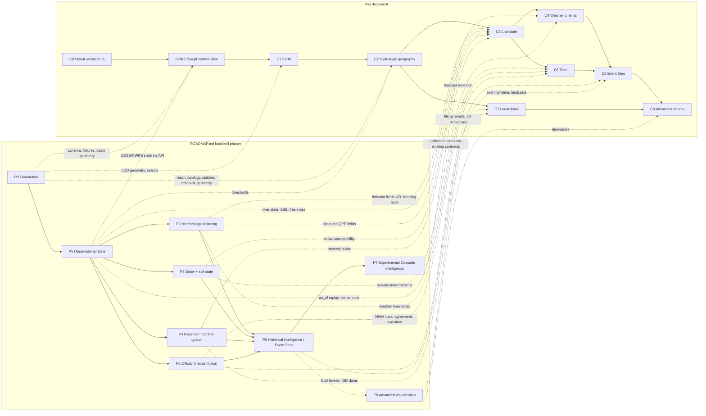

# CINEMATIC ROADMAP — incremental delivery of the world-as-interface client

The cinematic client ships as an ordered sequence of phases C0–C8 plus one
architecture-proving SPIKE, each pinned to a backend phase in [ROADMAP.md](ROADMAP.md).
Ordering is by dependency on contracts and data, never by visual payoff. Sizes are relative
(S/M/L/XL); there are no calendar dates. A phase is done when its exit criteria — tests and
artifacts, not adjectives — pass under the common definition of done (§3).

Two invariants bind every phase:

1. The client renders [VISUALIZATION_CONTRACTS.md](VISUALIZATION_CONTRACTS.md) and computes
   nothing hydrologic (ADR-0007). Colour, material, motion and camera exist only in
   `apps/web/src/layers/*/style.ts`, `camera/` and `layers/cinematic/`; no contract carries them.
2. Observed, official-forecast, modeled, derived/experimental and cinematic content stay
   visually and semantically distinct at every band, mode and quality tier
   ([DATA_DOCTRINE.md](DATA_DOCTRINE.md) §2, §12; [VISUAL_TRUTH_DOCTRINE.md](VISUAL_TRUTH_DOCTRINE.md) §1).

Siblings this sequence executes: [CINEMATIC_ARCHITECTURE.md](CINEMATIC_ARCHITECTURE.md)
(controllers §4.1, providers §10, package boundaries §12), [SEMANTIC_ZOOM.md](SEMANTIC_ZOOM.md)
(bands §1, search §9, Event/Presentation Mode §10), [LAYER_SYSTEM.md](LAYER_SYSTEM.md)
(`SceneLayer` §1, catalogue §8.2), [PERFORMANCE.md](PERFORMANCE.md) (budgets §2, tiers §3,
regression scenes §10), [CAMERA_SYSTEM.md](CAMERA_SYSTEM.md) (API §3, deep links §7, reduced
motion §8, tours §10), [TESTING.md](TESTING.md) §6, and the renderer boundary reference
[cesium-react-boundary.md](../.claude/skills/react-quality/references/cesium-react-boundary.md).
All seven cinematic documents are on disk (FACT, 2026-08-22); [DATA_SOURCES.md](DATA_SOURCES.md)
and [EVENT_ZERO.md](EVENT_ZERO.md) are linked where a phase depends on them.

## 1. Vocabulary used by every phase

| Term | Meaning (source) |
|---|---|
| band | `orbital · state · basin · river · local` (contracts §8) plus the client-only `ground` band that requests `band=local` (SEMANTIC_ZOOM §2.6, §14 OQ-1); search never lands at ground |
| truth class | `observation · authoritative_model · cascade_derived · cartographic · cinematic` (contracts §1; VISUAL_TRUTH_DOCTRINE classes A–E) |
| badge | the adjacent label for a value's `source_kind`: OBSERVED, OFFICIAL, model name, DERIVED, EXPERIMENTAL, CONFIGURED, UNKNOWN; plus STALE / DEGRADED / MISSING / PARTIAL from `Freshness` |
| layer id | an id from the LAYER_SYSTEM §8.2 catalogue, spelled as there (`watershed_boundaries`, `rivers`, `gauges`, `snow_cover`, `precip_forecast`, …); a phase "delivers" a layer by registering it. OPEN QUESTION: CAMERA_SYSTEM §4.5/§7 and PERFORMANCE §3/§4.5 still use older spellings (`river-network`, `gauges-forecast-points`, `atmosphere-haze`, `snow-level-plane`, `local-detail`); reconcile to the catalogue on their next edit |
| quality tier | `ultra · high · balanced · low` (PERFORMANCE §3); intelligence — panels, timeline, provenance — must be complete on `low` (boundary rule 8) |
| reduced motion | flights become cuts behind an opacity-only veil, cinematic animation stops, crossfades and label fades are instant; nothing else changes (SEMANTIC_ZOOM §12; CAMERA_SYSTEM §8) |
| cinematic element | truth class `cinematic`, labeled "visualization" in the inspector with its declared driver; it never changes a badge, value, category, label or entity count (VISUAL_TRUTH_DOCTRINE §2) |
| budget | a PERFORMANCE §2 row, cited by its id — `bundle_initial`, `bundle_scene`, `first_globe`, `flight_frame_time`, `band_settle`, `scene_memory`, `tile_requests_per_band`, `scrub_frame_time` — plus the unnamed caps there (idle frame cost, raster-layer cap, entity/label caps, panel latency); numbers live there, not here |

Phase template (every phase fills all eight): goal · scope · non-goals · backend
dependencies · deliverables · exit criteria · risks · size.

## 2. Dependency diagram



P7 adds no cinematic phase: a calibrated index arrives through the same contract fields
(`surfaces.susceptibility.experimental: false`; `surfaces.hazard.cascade_index` non-null only
when DATA_DOCTRINE §9 permits, with the per-field `truth` VISUAL_TRUTH_DOCTRINE §10 asks for)
and the existing badge logic renders it. OPEN QUESTION: ROADMAP.md's diagram shows only
`P1 → C1–C3` and has no P8 node; C3 here also needs P2 (QPE), P3 (snow, susceptibility) and
P4 (reservoirs), so C3 is staged C3a/b/c/d below, and the `P6 → P8` edge above is an
ASSUMPTION (C8 follows C6). ROADMAP.md's diagram should gain those edges on its next edit.

## 3. Common definition of done (every phase and the SPIKE)

- [ ] **Provenance on every value.** Every rendered number, category or state has an adjacent
      badge from its `ProvenanceRef.source_kind`; the layer inspector (LAYER_SYSTEM §3.1) shows
      `source_id`, `product_id`, `method_id`, the three timestamps, `freshness`, `quality`.
      Value-bearing component props require a `ProvenanceRef`; there is no prop for a bare number.
- [ ] **UNKNOWN and STALE are never calm.** UNKNOWN renders with its reason; stale values show age
      and STALE; a layer in `degraded`/`error`/`missing` says so in the inspector (LAYER_SYSTEM §7).
- [ ] **Reduced-motion path.** Every flight has a cut, every cinematic element an off state; the
      E2E scenario runs with and without motion and reaches an identical DOM.
- [ ] **Performance budgets.** PERFORMANCE §2 budgets (cited by id, §1) measured on the §10
      representative scenes under a fixed clock and local fixture tiles; counts and bundle size
      block from day one, timing and memory are advisory until calibrated (PERFORMANCE §10).
- [ ] **Tests at the TESTING.md levels.** Unit (pure TS: band math, framing, `style.ts` mapping,
      timeline math, provenance formatting); contract (generated types vs JSON Schema, Zod parse of
      fixtures); E2E (Playwright, seeded DB, fixed clock, zero network); visual regression (fixed
      camera, fixture contracts); perf regression (nightly).
- [ ] **Nested `AGENTS.md`** where real complexity exists — `scene/`, `layers/`, `timeline/` per
      CINEMATIC_ARCHITECTURE §12; a phase that creates comparable complexity elsewhere (flight
      presets in `camera/`, Event Mode) adds one and updates §12 in the same PR.
- [ ] **No Cesium types in app state.** `state/`, `panels/`, `api/` hold semantic values and entity
      ids only; lint forbids renderer imports outside `scene/`, `camera/`, `layers/*`.
- [ ] **No science in components.** No category from thresholds, no headroom, trend, unit
      conversion or model averaging anywhere in `apps/web`. Not in a contract ⇒ not displayed.
- [ ] **Cinematic is labeled and inert.** Doctrine test: snapshot with cinematic elements on vs
      off differs in pixels but in no badge, value, category, label or entity count.
- [ ] **Keyless default still runs.** The app boots and completes the SPIKE scenario with no
      provider keys (ADR-0006 `BasemapProvider` `osm-keyless`, ellipsoid `TerrainProvider`).
- [ ] **Accessibility.** Keyboard path search → selection → panel; contrast on dark glass; no
      information carried by colour alone; every layer has a `textEquivalent()`.
- [ ] **Vibesec checklist** passed; no third-party scripts; keys only via `/config/public`,
      domain-restricted (V1_AUDIT §5 S2; CINEMATIC_ARCHITECTURE §13).

## 4. C0 — VISUAL ARCHITECTURE (S) · delivered 2026-08-22

**Goal.** Decide in writing everything a renderer developer needs before the first line of
client code: truth doctrine, scene contracts, semantic zoom, camera architecture, provider
abstraction, performance goals, and this delivery sequence.

**Scope.** The sibling set in the preamble; ADR-0006 (web stack, keyless providers); ADR-0007
(renderer boundary); contracts §1–§10; the boundary reference; TESTING §6 scenarios.

**Non-goals.** No code; no renderer evaluation beyond ADR-0006's alternatives table; no visual
comps; no per-basin camera bookmarks; no shader research.

**Backend dependencies.** DOMAIN_MODEL §1 identifier doctrine (ids are the selection
vocabulary); contracts v1.0.0; ROADMAP Phase 0 documentation deliverable (done 2026-08-22).

**Deliverables.** The documents, cross-linked; the phase template; the DoD checklist (§3).

**Exit criteria.** The CONTEXT.md human check passes for the renderer boundary and "the next
phase's exit criteria" from these docs alone; every contract field the SPIKE panel (§5.1) reads
exists in contracts §2–§3; no document names a colour, material or camera instruction as a
contract field. FACT: all seven cinematic documents ([CINEMATIC_ARCHITECTURE.md](CINEMATIC_ARCHITECTURE.md),
[VISUAL_TRUTH_DOCTRINE.md](VISUAL_TRUTH_DOCTRINE.md), [SEMANTIC_ZOOM.md](SEMANTIC_ZOOM.md),
[CAMERA_SYSTEM.md](CAMERA_SYSTEM.md), [LAYER_SYSTEM.md](LAYER_SYSTEM.md), [PERFORMANCE.md](PERFORMANCE.md),
this file) are on disk as of 2026-08-22; their cross-document open questions (layer-id spelling,
§1; deep-link grammar, §7) are tracked in §15 and reconciled same-day per CONTEXT.md.

**Risks.** Drift between documents written in parallel (CONTEXT.md same-day reconciliation;
each file's open-question list names the conflicts); constants fixed before measurement
(SEMANTIC_ZOOM §1 boundaries and PERFORMANCE §2 numbers are ASSUMPTIONs the SPIKE retunes).

## 5. The SPIKE — Skagit vertical slice (M)

**Goal and scope.** Position: after C0, before C1 and C2 are built out (SEMANTIC_ZOOM §14 OQ-6
calls it the "C1 spike"). It is the first code in `apps/web`; its module skeleton is the
permanent one, extended later and never discarded. It cuts a thin vertical slice through C1
(globe, flight, search, basin geometry), C2 (selection, ids, one panel) and C3a (live river
state from the V2 API), and nothing wider. Its purpose is to prove the renderer boundary, the
contract path and the keyless boot on real USGS/NWPS rows — not to look finished.

### 5.1 The slice, step by step

```
 1. BOOT     BasemapProvider 'osm-keyless' + ellipsoid TerrainProvider (level 'global');
             Cascadia framed at band=orbital. No account, no key, no terrain feed.
 2. SEARCH   "Skagit" → GET /search?q=skagit → { id: "basin:skagit", bbox, home band: basin }
             → CameraController.flyTo({kind:'entity', id}, {reason:'search'}) → exactly one
             SemanticZoomController bandChanged {next:'basin', cause:'jump'} (SEMANTIC_ZOOM §5)
             → FlightHandle.settled resolves {outcome:'settled', band:'basin'} (CAMERA_SYSTEM §3).
             reduced motion → a cut behind the veil (CAMERA_SYSTEM §8): {cut:true}, same final
             pose, same events.
 3. SELECT   store.selectedEntityId = "basin:skagit"; outline emphasis is style.ts only.
 4. BASIN    GET /basins/basin:skagit/state → BasinVisualizationState 1.x + provenance_refs.
    STATE    Panel: name, regulation_class, hazard.official_category (+OFFICIAL badge iff
             prov.source_kind = OFFICIAL_FORECAST), official_alerts verbatim with issuer,
             freshness age per value; susceptibility and forcing render UNKNOWN with reason
             "not yet produced (P3 / P2)" — never blank, never calm.
 5. GAUGE    gauges-layer entity station:usgs:12200500 / fp:nwps:MVEW1 selectable by
             click and keyboard → GET /stations/station:usgs:12200500/state →
             RiverVisualizationState: observed.stage (ft, datum NGVD29) and observed.flow
             (cfs) +OBSERVED +valid_time/retrieved_at; thresholds action/minor/moderate/major
             +OFFICIAL +basis +datum; official_forecast.crest +OFFICIAL +issued_at;
             observed_category; headroom and trend +DERIVED with method pointer.
 6. FRESH    a seeded stale series renders STALE with age; a missing threshold renders UNKNOWN.
```

Data path (design, ARCHITECTURE §1): worker ingests USGS (OGC API per ROADMAP Phase 1; a
legacy-IV adapter is a stop-gap) and NWPS gauge/stageflow → append-only tables → API
projection → contract document. `apps/web` never calls a provider. CI uses a seeded database
from `tests/fixtures/` or the fixture-backed API stub (TESTING §1) with a fixed clock; the demo
runs the same build against live-ingested rows (`scripts/dev-backend.sh`). OPEN QUESTION: the
spike's backend on disk (2026-08-22) stores rows in SQLite (`aiosqlite`, root `pyproject.toml`)
and serves `uvicorn` without the dev compose; P0 exit requires PostGIS + Alembic, so the SQLite
store is a SPIKE-only stand-in that must not outlive it.

### 5.2 What the SPIKE must NOT contain

- A basemap or terrain source that requires a key to boot.
- Any value not delivered by a contract: no placeholder stage, no demo snowpack, no synthetic
  forecast; no wake-up driven by `tension` (its thresholds are set in C3).
- Weather layers, a timeline, or a renderer clock driven by anything but `store.time`.
- Custom shaders; atmosphere beyond the default sky; water rendering; 3D Tiles.
- More UI than: search, one entity panel, a minimal layer inspector (layers, truth class,
  provenance of the selected value), a reduced-motion toggle.
- Any renderer type in `state/` or a React prop; any hydrologic arithmetic in TypeScript.

### 5.3 Module skeleton (our own modules; renderer calls stay inside `scene/`, `camera/`, `layers/*`)

```ts
// apps/web/src/layers/contract.ts — SceneLayer exactly as LAYER_SYSTEM §1 (mount/unmount/dispose,
// setTime, setVisible, setData, setQualityTier, status, provenance(), textEquivalent(), budget()).
// The SPIKE registers: imagery, terrain, watershed_boundaries, gauges, labels (LAYER_SYSTEM §8.2).

// apps/web/src/camera/ — CameraTarget, FlightOptions, FlightHandle and CameraEvents exactly as
// CAMERA_SYSTEM §2–§3; the SPIKE uses this subset:
//   flyTo({ kind: 'entity', id: 'basin:skagit' }, { reason: 'search' }).settled
//     → { outcome: 'settled' | 'interrupted', band, cut }
//   setMotionPreference('reduced' | 'full')           // resolved from the OS setting + user toggle (§8)
//   on('settled' | 'interrupted' | 'bandChange', …)   // band *meaning* comes from SemanticZoomController
// apps/web/src/scene/SemanticZoomController.ts — deriveBand + bandChanged { next, cause } as SEMANTIC_ZOOM §5

// apps/web/src/state/scene.ts — semantic values only (boundary rule 2); extended per CAMERA_SYSTEM §2 in C1
export interface SceneSlice {
  selectedEntityId: EntityId | null; hoverEntityId: EntityId | null;
  band: SemanticBand;                                     // never height, pitch or bbox
  time: { valid: IsoInstant; mode: 'now' | 'past' | 'forecast'; asOf: IsoInstant | null };
  layers: Record<LayerId, { intent: boolean; status: LayerStatus; reason: string | null }>;
  qualityTier: QualityTier; reducedMotion: boolean;
}
```

`scene/bridge.ts` is the only module subscribing the store to controllers. `layers/basins/style.ts`
and `layers/rivers/style.ts` (gauges live in the `rivers/` domain, CINEMATIC_ARCHITECTURE §12)
are the only places presentation values appear. The skeleton on disk (2026-08-22) has
`layers/{basemap,basins,rivers}`, `scene/`, `camera/`, `state/`, `api/`, `panels/`,
`interactions/`, `contracts/`, `design-system/` — the same shape. Framing is a pure function of
the entity's display geometry (CAMERA_SYSTEM §5.1; the search result's bbox seeds it), so the
ellipsoid default and a real terrain tier yield the same camera target; the band reported at
arrival can differ near a boundary because quantization uses height above terrain
(SEMANTIC_ZOOM §1) — INFERENCE: the margin is adequate at basin band; CAMERA_SYSTEM §13 asks for
the tolerance to be measured.

### 5.4 Backend dependencies

- P0 exit: migrations; fixtures for USGS IV and NWPS gauge/stageflow; six seed basin polygons
  with LOD display geometry; JSON Schema export from `packages/contracts`.
- P1 partial: `/search`, `/basins/{id}`, `/basins/{id}/state`, `/stations/{id}/state`,
  `/forecast-points/{lid}/thresholds`, `/system/freshness`; fixture documents for
  `BasinVisualizationState` and `RiverVisualizationState`; freshness computed at read time.
- Not required: SSE, `as_of`, assessments beyond `hazard.official_category`, any grid.

### 5.5 Acceptance tests (zero network; blocking)

1. **E2E (Playwright, seeded DB or fixture stub, fixed clock 2026-08-22T09:00:00Z):** search
   "Skagit" → `FlightHandle.settled` resolves `outcome:'settled'` and exactly one
   `bandChanged {next:'basin', cause:'jump'}` reaches the store →
   `selectedEntityId === "basin:skagit"` → panel shows OFFICIAL on the official category and a
   freshness age → `station:usgs:12200500` selectable by click and by keyboard → river panel
   shows OBSERVED on stage and flow, OFFICIAL on thresholds and crest, DERIVED on headroom and
   trend, the text "NGVD29" and a unit on every number → repeat under
   `prefers-reduced-motion: reduce`: no flight, a cut, identical end state and DOM.
2. **E2E degraded:** seeded stale series → STALE with age; missing threshold → UNKNOWN with
   reason; a `CONFIGURED` threshold fixture → "configured" badge and no category derived from it.
3. **Contract:** generated TS types equal committed types; every fixture document parses through
   Zod; the seeded API's responses validate against the JSON Schema.
4. **Visual snapshot:** "Cascadia overview" (orbital) and "Skagit basin" (basin band), fixture
   data, fixed camera, `balanced`, motion off.
5. **Unit:** band quantization with hysteresis, bbox framing, `style.ts` for every
   `observed_category` × `Freshness.state`, formatting of the three timestamps, badge from
   `source_kind` (property test: OFFICIAL only from `OFFICIAL_FORECAST`).
6. **Boundary:** lint fails on renderer imports outside the allowed folders; a type test fails
   if `state/` references a renderer type; React commits during the flight stay under the
   PERFORMANCE §10 fixed small number.
7. **Perf smoke (advisory):** `first_globe`, `flight_frame_time` (p50/p95) and
   `tile_requests_per_band` recorded as the baseline PERFORMANCE.md adopts.

**Deliverables.** The §5.3 skeleton with its five layers, search, one entity panel, the minimal
inspector and the reduced-motion toggle; the §5.4 read endpoints over P1 adapters; fixtures and
the seeded/stub CI path; the §5.5 tests; `apps/web/AGENTS.md`, `scene/AGENTS.md`; the perf baseline.

**Exit criteria.** Tests 1–6 green in CI; a developer with no accounts runs the dev backend
(`scripts/dev-backend.sh`, or the dev compose once P0 lands PostGIS) and the slice end-to-end on
live-ingested rows; `apps/web/AGENTS.md` and `scene/AGENTS.md` exist; PERFORMANCE.md records the
baseline; SEMANTIC_ZOOM §1 constants confirmed or retuned.

**Risks.** Renderer asset handling under Vite (code-split and lazy-load the scene, ADR-0006;
OPEN QUESTION: `apps/web/vite.config.ts` uses `vite-plugin-static-copy` as ADR-0006 prescribes,
but `apps/web/package.json` lists `vite-plugin-cesium` — which ADR-0006 avoids — and not
`vite-plugin-static-copy`; reconcile before SPIKE exit); public OSM raster tiles are acceptable
for development only — best-effort, no SLA, heavy use blocked, pre-seeding banned (FACT,
`docs/research/rendering-stack-and-geodata-delivery.json`, retrieved 2026-08-22) — so
`BasemapProvider.usage` must encode that policy and C1 must pick a production default (§15);
P1 not yet serving live rows (CI is fixture-seeded; the live run is a C1 item).

## 6. C1 — EARTH (M)

**Goal.** A real, calm Cascadia: imagery, terrain, basic atmosphere, a camera that feels
inevitable, search, and the six basin geometries — nothing that claims to be hydrology.

**Scope.** `BasemapProvider` set: `osm-keyless` default plus keyed vendor imagery via
`/config/public` (CINEMATIC_ARCHITECTURE §10; attribution, `usage`, `cspHosts` honoured).
`TerrainProvider` levels `global` → `regional_dem` with the inspector line "terrain shown /
science DEM" (visual terrain ≠ scientific DEM). `atmosphere_haze` as `cinematic`, sun from
`t`. `CameraController`: fly-to, orbit, frame, settle/interrupt, reduced-motion cuts, keyboard
and pointer navigation. `SemanticZoomController` with hysteresis and per-layer LOD. Search
over `/search?q=` for basins, stations, forecast points, reservoirs (SEMANTIC_ZOOM §9).
`watershed_boundaries` at regional/state/basin LOD from `display_geom_lod[]` (plus
`cascadia_context` at orbital/state); `labels` with band budgets.
Quality-tier detection and override (PERFORMANCE §3). Perf harness and the "regional" scene.

**Non-goals.** No state values; no `rivers` (C2); no weather; no timeline; no 3D Tiles
or photogrammetry; no custom shaders; no water rendering; no camera bookmarks per basin; no
`ground` band.

**Backend dependencies.** P0: basin polygons with LOD geometry, `/basins`, `/basins/{id}`,
`/search` with ETags. Runs against fixtures when the API is absent.

**Deliverables.** `scene/`, `camera/` (+ `camera/AGENTS.md` if flight presets warrant it),
layers `imagery`, `terrain`, `atmosphere_haze`, `cascadia_context`, `watershed_boundaries`,
`labels` (folders per CINEMATIC_ARCHITECTURE §12), `entities/` search adapters, `state/`,
`scene/bridge.ts`, perf harness, measured values for `bundle_initial`, `bundle_scene`,
`first_globe`, `flight_frame_time` and `tile_requests_per_band`.

**Exit criteria.** Keyless boot with zero external accounts; vendor tier switch without a
reload; search for each seed basin flies and settles with band events in order; reduced-motion
cut; unit tests for hysteresis and framing; snapshots "Cascadia overview" and "Skagit basin";
`bundle_initial` and `bundle_scene` within cap with the scene lazy-loaded; label budget never
exceeded (counter test); SPIKE E2E still green.

**Risks.** Keyless tile policy (SPIKE risk carried); terrain-tier framing at river/local (C7);
Vite/renderer asset fragility (pin and document in `scene/AGENTS.md`).

## 7. C2 — HYDROLOGIC GEOGRAPHY (M)

**Goal.** The hydrologic skeleton as selectable entities with stable backend ids: basins,
reaches, gauges, forecast points, reservoirs; intelligence panels carrying geography,
regulation and official thresholds.

**Scope.** `rivers` from `/basins/{id}/reaches` by `stream_order` and band LOD (state ladder
deferred to C3; cartographic only here) with `topology_arrows` (direction, never velocity);
`gauges` extended to SNOTEL stations, plus the `thresholds` layer at river band; `reservoirs`
pool polygons and dam points; subbasin rows of `watershed_boundaries` at basin band
(LAYER_SYSTEM §8.2); selection pipeline in `interactions/` (pick → select, hover, keyboard);
deep links in the CAMERA_SYSTEM §7 grammar (`/basin/<slug>?sel=<EntityId>&cam=…`; OPEN
QUESTION: SEMANTIC_ZOOM §8 still writes `?e=&band=` — reconcile to §7); `panels/` EntityPanel:
regulation class, datums, drainage area, thresholds table (basis stage|flow, unit, datum,
OFFICIAL or CONFIGURED badge), topology navigation (`upstream`/`downstream`); layer inspector
v1; `layers/AGENTS.md`.

**Non-goals.** No live values beyond the SPIKE's; no flow animation implying depth, velocity
or extent; no weather; no time; no `levees` or `local_detail` (C7); no per-reach
thresholds where no official forecast point exists (HYDROLOGY §5).

**Backend dependencies.** P0 reach topology, stations, forecast points, reservoir geometry;
P1 `/forecast-points/{lid}/thresholds` versioned rows. OPEN QUESTION: P0 ships vector tiles or
simplified GeoJSON per LOD (ARCHITECTURE §7 allows either); the layer reads `geometry_ref`
either way, but tile infrastructure changes the perf plan.

**Deliverables.** `rivers`, `topology_arrows`, `thresholds`, `reservoirs`, the subbasin rows and
the SNOTEL `gauges` extension, `interactions/`, `EntityPanel`, topology navigation, inspector v1,
deep links, `layers/AGENTS.md`, the "basin" perf scene.

**Exit criteria.** Every seed gauge and forecast point selectable by click and keyboard; deep
link restores entity, time and camera (CAMERA_SYSTEM §7 round-trip property); Green
(`fp:nwps:AUBW1`) and White (`fp:nwps:WRAW1`) thresholds render with basis `flow` in the
delivered unit, never converted client-side; a datum mismatch shows the backend's refusal, not
a comparison; snapshot "river selection"; `tile_requests_per_band` and river polyline vertex
caps met at state band; boundary lint green.

**Risks.** River geometry volume at state band (LOD discipline in `packages/geo`); label
collision (priority from `display.label_priority` only); pick latency on dense networks.

## 8. C3 — LIVE STATE (L)

**Goal.** The world shows current hydrologic state truthfully: river state, basin
susceptibility, observed precipitation, snow, reservoirs — every value badged, fresh or marked
stale, UNKNOWN when unknown. Staged by what the backend serves.

**Scope.**
- **C3a (P1).** `rivers` state ladder and `gauges` state: `observed_category`, `trend`,
  `headroom`, `official_forecast.crest`; `flow_visual_intensity` is the only flow style input
  (a percentile-derived hint, not depth). `basin_susceptibility` over `watershed_boundaries`:
  `hazard.official_category`, `delta`, `headline_drivers` (OPEN QUESTION: the spike's on-disk
  `BasinVisualizationState` schema has no `delta` and puts `label_priority` at top level, unlike
  VISUALIZATION_CONTRACTS §2 — reconcile schema and document); `official_alerts` verbatim;
  `hazard_summary` at orbital/state. SSE client in `api/`: on `{kind, scope}` invalidate the
  keyed query; no payloads over the stream. Freshness → STALE/DEGRADED/PARTIAL marks.
  Progressive wake-up (VISUAL_TRUTH_DOCTRINE §7.4): `tension` may raise the scene to Elevated,
  never to Major event; cut points are ASSUMPTIONs recorded in `style.ts`.
- **C3b (P2).** `precip_observed`: `WeatherVisualizationState.fields` with `kind: observed`
  (MRMS QPE, truth `observation`, `method=radar_qpe`) as raster tiles with `display_range`;
  basin aggregates in the panel; windows 1–72 h.
- **C3c (P3).** `snow_cover` (SWE by band, SCA raster, anomaly) and `snow_points` (SNOTEL,
  `observation`); `snow_level` as a visualization of the modeled snow level with its stored
  offset parameter; `rain_exposed_fraction` and `rain_on_snow_exposed_fraction` as highlighted
  hypsometric bands and numbers (`cascade_derived`). A rising snow level never removes snow.
  `soil_state` from `headline_drivers` (OPEN QUESTION: no `SoilVisualizationState`,
  CINEMATIC_ARCHITECTURE §17; SEMANTIC_ZOOM §14 OQ-4). Susceptibility with EXPERIMENTAL badge
  and drivers.
- **C3d (P4).** `reservoirs` storage envelope: pool, `available_buffer` (DERIVED),
  trend; UNKNOWN with reason where operator data is web-only; operations reported, never inferred.

**Non-goals.** No forecast precipitation, clouds or rain effects (C4); no timeline — "now" only
(C5); no Cascade probability anywhere; no inundation, depth or extent; no averaging of
disagreeing forecasts (agreement is a state with an explanation); no unit conversion.

**Backend dependencies.** P1 exit (state endpoints, thresholds, SSE, contract tests for Basin
and River states); P2 for QPE fields and tile derivatives; P3 for `SnowVisualizationState` and
the EXPERIMENTAL susceptibility assessment; P4 for `ReservoirVisualizationState`;
`/scene/summary?bbox=&band=&t=` per band; `/system/freshness`.

**Deliverables.** State channels on the C2 layers; `basin_susceptibility`, `precip_observed`,
`snow_cover`, `snow_points`, `snow_level`, `soil_state`, `official_alerts`, `hazard_summary`;
SSE client; provenance components in `design-system/` (badges, provenance popover, freshness
age); inspector v2 (per-value provenance); degraded-layer handling; the "multi-layer" perf scene.

**Exit criteria.** E2E: degraded source shows STALE not calm; UNKNOWN with reason; flow-defined
categories correct; every panel number has a badge and unit; susceptibility shows
EXPERIMENTAL and a method pointer; SSE event → refetch → DOM update under a fixed clock; `low`
tier shows full intelligence; wake-up test: `tension` alone never produces the Major-event
layout; snapshots "snow layer" and "degraded data"; contract tests for all served state
contracts; raster-layer cap enforced with a UI notice.

**Risks.** Visual overload at basin band (band matrix defaults, LAYER_SYSTEM §4.2); depth
creeping into river style (style takes only `flow_visual_intensity` and category); raster
pipeline readiness (degrade to basin aggregates, shown as such); SNODAS maritime bias
(inspector shows product and climatology period).

## 9. C4 — WEATHER CINEMA (L)

**Goal.** Atmospheric forcing made legible: forecast precipitation per horizon, freezing and
snow level, rain/snow partition by elevation band, atmospheric-river visualization, and
restrained cloud/rain elements that are unmistakably cinematic.

**Scope.** `precip_forecast`: `fields` with `kind: forecast` (`qpf_6h` and windows to 120 h)
from NBM/HRRR, model name, `issued_at` and `valid_time` always visible, `spread` drawn when
present. `atmosphere_ivt` (`ivt` raster) and `ar_corridor` (the corridor glyph from `ar`: `scale`,
`ivt_max`, `orientation_deg`, `duration_h`), drawn only when `ar.present`; "storm path" is the time
sequence of forecast fields, labeled with the model (SEMANTIC_ZOOM §14 OQ-3). `temperature_rain_snow`:
`freezing_level`, `temperature_2m`, the basin snow level with its offset parameter, and the two
exposed fractions from the Snow contract. Forcing surface per horizon (6/12/24/48/72/120 h)
with drivers and spread; horizon selector. `layers/cinematic/`: cloud and rain impressions at
basin band, tier-gated (off on `low`), off under reduced motion, each declaring its driver
(VISUAL_TRUTH_DOCTRINE §3.6–3.7); intensity keyed to `display_range` of the field it decorates.

**Non-goals.** No time scrubbing (C5; horizon selection is not time travel); no storm-track
animation implying trajectory certainty; no synthetic precipitation where a field is missing;
no lightning, thunder or audio; no local water; no client-side grid aggregation; procedural
clouds remain "conceptual (no data)" until a cloud-cover variable exists (VISUAL_TRUTH §3.6, §10).

**Backend dependencies.** P2 exit (basin QPF every cycle, `WeatherVisualizationState`,
COG/tile derivatives, forcing assessment with drivers, AR detection); P3 for rain-on-snow
exposed fraction; `/scene/summary` at orbital/state bands with region fields.

**Deliverables.** `precip_forecast`, `atmosphere_ivt`, `ar_corridor`, `temperature_rain_snow`,
`layers/cinematic/`, horizon control, forcing panel with drivers and spread, the doctrine test
for cinematic elements.

**Exit criteria.** Every weather field shows model, issued and valid times; AR glyph present iff
`ar.present`; spread visible wherever the contract carries it; cinematic elements absent under
reduced motion and on `low`; doctrine test passes; snapshot "storm layer"; `flight_frame_time`
floor met at basin band with cinematic elements on in `balanced`; E2E: change horizon →
forcing panel and basin state update with drivers.

**Risks.** Cinematic elements read as data (doctrine test, inspector label, VISUAL_TRUTH
restraint rules); GPU cost of field rasters (LOD and tier gates, raster cap); no IVT spread
raster in the contract (LAYER_SYSTEM §8.3, §13) — spread shown numerically only.

## 10. C5 — TIME (L)

**Goal.** One timeline for past observations, the present, and forecast horizons; forecast
runs as first-class objects; a deterministic replay engine driven by `as_of`.

**Scope.** `timeline/`: `TimelineController` and `PlaybackEngine` (window `[now−72h, now+120h]`
or `[T−72h, T+120h]` in replay; bounded store writes, ≤ 10 Hz ASSUMPTION per
CINEMATIC_ARCHITECTURE §4.1); every layer's `setTime` selects a slice from cache or requests it
through `api/` keyed by entity/time/band/`asOf`; `SceneClock` is driven from the store, never
the reverse. Replay via `?as_of=T` on every read endpoint. Hydrographs per station in
`panels/`: observed stage/flow with official thresholds, official forecast and named model
forecasts as distinct series with distinct badges. Forecast run picker by `issued_at`;
superseded runs shown as superseded; `model_disagreement` with agreement state and
explanation. Prefetch of adjacent slices within PERFORMANCE §4.5 caps; abort on change.
`timeline/AGENTS.md`.

**Non-goals.** No event narrative (C6); no interpolation between valid times presented as data
— between-slice blending is declared `cinematic_continuity` (LAYER_SYSTEM §2.4), off under
reduced motion, never changes a displayed value; no prediction beyond official and named-model
forecasts; no science recompute on scrub (the server is a pure function of `as_of`).

**Backend dependencies.** P1 `as_of` on all read endpoints, `/stations/{id}/series` with cursor
pagination, `/forecast-points/{lid}/runs` and `/forecast-points/{lid}/runs/{run}/values`; P5
for NWM runs, model agreement and the forecast-evolution endpoint; P2 for weather time slices.

**Deliverables.** `timeline/`, hydrograph panel, run comparison view, `model_disagreement`,
time-keyed query layer with abort and bounded prefetch, the "event" perf scene's scrub path.

**Exit criteria.** E2E "timeline scrub changes state"; knowledge-time test: at `as_of=T` no
rendered value has `available_at > T` (golden seeded DB); a superseded run is visible as
superseded, never deleted; replay is deterministic (same inputs → identical DOM sequence);
unit tests for window math and tick labeling; snapshot "forecast run comparison";
`scrub_frame_time` within budget; a scrub at 60 Hz yields at most one `setTime` per frame
(PERFORMANCE §7); abort test: a time change cancels in-flight requests for the previous key.

**Risks.** Memory growth from cached slices (LRU by bytes per layer, PERFORMANCE §4.6); drift
between renderer clock and store (single source of truth in `bridge.ts`); tweening temptation
(doctrine test extends to time).

## 11. C6 — EVENT ZERO (L)

**Goal.** The December 2025 atmospheric-river flood reconstructed and replayable with only
knowledge-time data: forecast evolution, official warnings verbatim, and the observed outcome
— the Skagit at Mount Vernon crested at a preliminary record 37.73 ft / 132,717 cfs on
2025-12-12 08:15Z (FACT: NWPS crest table in
`docs/research/event-zero-december-2025-western-washington-floods.json`, retrieved 2026-08-22;
HYDROLOGY §12 rounds the flow to ~133,000 cfs; [EVENT_ZERO.md](EVENT_ZERO.md) holds the evidence rows).

**Scope.** Event Mode (SEMANTIC_ZOOM §10; LAYER_SYSTEM §4.4 overrides) for
`event:2025-12-western-wa-ar`, entered from a search result that sets `time.mode = past` and
`asOf` to the first timeline entry. `/events/{id}/timeline` rendered by `EventTimelineEntry.kind`
(forecast_issued, warning_issued, crest_observed, reservoir_action, levee_incident, evacuation,
declaration, note) with `ref` evidence links. Guided replay over curated clock times as a
CAMERA_SYSTEM §10 `TourDefinition` authored in client config: stops target entity ids and bands
wherever an entity exists, a `point` target only where none does, and the camera is never a
backend field. Forecast evolution view (runs vs observed
outcome). `OfficialAlert` verbatim with issuer and times, badged OFFICIAL. Hindcast overlay of
what Cascade showed at T, badged EXPERIMENTAL with `method_id`. Backfilled products visibly
flagged (ADR-0010). Outcome shown with its `quality` flag as delivered.

**Non-goals.** No narrative text generated by a language model; no dramatization — no synthetic
floodwater, no inundation extent (none is in ROADMAP.md; LAYER_SYSTEM §13), no casualty framing;
no life-safety language; no audio; no generic "story builder".

**Backend dependencies.** P6 exit (event database, reconstruction with `available_at` per
product version, hindcast harness, replay endpoint, analog search); P5 forecast evolution; C5.

**Deliverables.** `eventMode` store slice, event timeline panel, forecast evolution chart,
warnings timeline, bookmarked tour config, look-ahead E2E, the "event" perf scene complete.

**Exit criteria.** Replay from event start through crest reproduces the committed hindcast
outputs (golden); look-ahead E2E: at every tour stop no rendered value has `available_at > T`;
the crest shows OBSERVED plus its quality flag and datum; warnings verbatim with issuer and
`issued_at`; backfilled flag visible in inspector and panel; snapshot "event mode"; the tour
works as cuts under reduced motion; analog search results render with evidence links.

**Risks.** Archive gaps (ROADMAP "what would change") render as flagged reconstructions, never
silent fills; emotional framing of a real disaster (VISUAL_TRUTH restraint rules; human-authored
tour; checklist review); bookmarks drifting from geometry revisions (ids and bands, not coordinates).

## 12. C7 — LOCAL DETAIL (XL)

**Goal.** The local and ground bands: levees, high-resolution terrain, LiDAR point clouds,
infrastructure, selected photogrammetry — authoritative attributes, no guarantees, no water
surface derived from stage.

**Scope.** `levees` from NLD with attributes verbatim (`design_height` is a design
height, HYDROLOGY §10). `floodplain_regulatory` (NFHL) in the
VISUAL_TRUTH §3.1 register for that kind only. Dams (NID) and gauge structures on
`reservoirs` / `gauges`. `TerrainProvider` levels `wa_product` and `lidar`
from 3DEP-derived tiles built offline and served from object storage (INFERENCE on format:
quantized-mesh-class terrain built offline from DNR/3DEP DEMs, per the research file cited in
ADR-0006; decided by ADR when P8 derivative tooling lands). `local_detail`:
LiDAR as 3D Tiles for selected reaches, starting with the lower Skagit at Mount Vernon (OPEN
QUESTION: licensing and size — Washington DNR LiDAR is the candidate, described as "publicly
available" with no licence text found (same research file); record the terms in
[DATA_SOURCES.md](DATA_SOURCES.md) before ingestion); photogrammetry only where a site source
exists. `ground` band enabled by tier and viewport; `water_surface_local` at the mapped channel
extent (cartographic; shimmer cinematic). `communities` geometry where served. Pick-and-inspect
with source badge; `low` shows 2.5D with identical panels.

**Non-goals.** No inundation or water-surface elevation; no stage draped on terrain as water;
no "will hold"; no statewide point clouds; no exposure analytics (a later backend phase); no
building-level damage estimates.

**Backend dependencies.** P4 NLD/NID static data with attributes and geometry; P0 geometry
pipeline; P8 `packages/visualization` derivative generation (tile pyramids, 3D derivatives) in
object storage/CDN; OPEN QUESTION (PERFORMANCE §14): a finer-than-`basin` display LOD for
levee/channel geometry.

**Deliverables.** `levees`, `floodplain_regulatory`, `local_detail`, `water_surface_local`,
`communities`, terrain levels, offline 3D Tiles tooling (runbook under `infra/`), the local/ground
camera rules of CAMERA_SYSTEM.md §5 and §8 applied (amended in the same PR if its §13 tolerance
measurement changes them), the "local" perf scene, `layers/AGENTS.md` update.

**Exit criteria.** Levee attributes verbatim with NLD badge; terrain level switch keyless →
`wa_product` without restart; 3D Tiles within the `scene_memory` ceiling at `balanced`; snapshot
"local band, Mount Vernon"; perf regression on the "local" scene; reduced-motion path; doctrine
test: no layer at local or ground band consumes a stage value to place water.

**Risks.** Data volume and GPU memory; licensing; vertical datum confusion — terrain heights
versus gauge datums (NGVD29 at `fp:nwps:MVEW1`) are never compared on the client (ADR-0009);
photogrammetry implying currency it lacks (capture date shown as provenance).

## 13. C8 — ADVANCED CINEMA (XL)

**Goal.** The finishing layer: advanced shaders, enhanced atmosphere, realistic local water
rendering inside the truth doctrine, presentation mode, and an investigation of a future
Unreal client consuming the same contracts.

**Scope.** Shaders in `layers/cinematic/` behind quality tiers (post-processing ≤ the
PERFORMANCE §2 guidance on `high`, none on `balanced`/`low`): atmosphere scattering,
precipitation, lighting (VISUAL_TRUTH §3.8). River water material at river/local/ground bands
driven only by `flow_visual_intensity` and `observed_category` over the mapped channel extent —
never depth, extent or velocity (LAYER_SYSTEM §9.6). Night mode. Presentation Mode
(SEMANTIC_ZOOM §10): hidden chrome, bookmarked tours, fixed-clock demos on fixture data labeled
"demo data" whenever not live. Performance re-baselining at `ultra`/`high` including the
"GPU stress" scene. Unreal investigation: a spike rendering `SceneSummary` at basin band from
the same JSON Schema (CINEMATIC_ARCHITECTURE §16), reported as an ADR with go/no-go.

**Non-goals.** No science or contract changes; no renderer concept added to any contract; no
audio or narration (ROADMAP explicit rejections); no shader required for intelligence; no
replacement of the web client.

**Backend dependencies.** None new; stable contract versions; P8 derivatives.

**Deliverables.** Shader set, `presentation/` mode, night mode, Unreal spike ADR, PERFORMANCE
§3 tier table revised.

**Exit criteria.** Doctrine test across every cinematic element; frame-time floors and cache
ceilings met per tier on the representative scenes; presentation-mode E2E (enter, tour, exit,
state preserved); snapshot "night mode"; demo-data label present whenever the data source is a
fixture; Unreal ADR merged with a decision.

**Risks.** Cinematic elements read as data (same test, stricter review); shader maintenance
across renderer versions (isolate, version-pin); scope creep into science (contracts frozen for
this phase by rule).

## 14. Summary

| Phase | Size | Hard backend gate | Primary contracts | Layers registered (LAYER_SYSTEM §8.2) |
|---|---|---|---|---|
| C0 | S | P0 docs (done 2026-08-22) | all, as documents | — |
| SPIKE | M | P0 exit + P1 partial | Basin, River | imagery, terrain, watershed_boundaries, gauges, labels |
| C1 | M | P0 exit | geography, search | atmosphere_haze, cascadia_context (+ vendor providers) |
| C2 | M | P0 exit, P1 thresholds | River (thresholds, topology) | rivers, topology_arrows, thresholds, reservoirs (+ subbasin rows of watershed_boundaries) |
| C3 | L | P1 exit; P2/P3/P4 staged | Basin, River, Snow, Reservoir, Hazard, Weather(observed) | basin_susceptibility, precip_observed, snow_cover, snow_points, snow_level, soil_state, official_alerts, hazard_summary |
| C4 | L | P2 exit, P3 fractions | Weather(forecast), Snow | precip_forecast, atmosphere_ivt, ar_corridor, temperature_rain_snow, cinematic elements in `layers/cinematic/` |
| C5 | L | P1 `as_of`, P5 runs | all time-sliced; Explanation | model_disagreement |
| C6 | L | P6 exit, C5 | event timeline, hindcasts, Explanation | (Event Mode overrides) |
| C7 | XL | P4 static, P8 derivatives | FloodDefense/Dam geometry, tiles | levees, floodplain_regulatory, local_detail, water_surface_local, communities |
| C8 | XL | none new | unchanged | (shaders within cinematic) |

## 15. Open questions

1. ROADMAP.md's diagram lacks `P2/P3/P4 → C3` edges and a P8 node, and its Phase 8 lists "basin maps, river
   network, terrain", which this document delivers in C1–C3. Reconcile on the next ROADMAP edit.
2. Production keyless basemap: which imagery source permits sustained public use without a key,
   or whether the default becomes self-hosted raster tiles (C1 exit item).
3. P0 geometry delivery format (vector tiles vs simplified GeoJSON per LOD) — affects C2 perf.
4. Dual-unit display (DATA_DOCTRINE §6, "SWE in inches beside mm"): either contracts carry both
   values as DERIVED with lineage, or the client is granted display-only conversion with a
   registry-pinned factor. This document assumes the former until an ADR-0009 amendment.
5. `SoilVisualizationState` (CINEMATIC_ARCHITECTURE §17; SEMANTIC_ZOOM §14 OQ-4) — decide before C4.
6. LiDAR/photogrammetry licensing and size for C7.
7. Layer-id spelling: this document, LAYER_SYSTEM §8.2 and SEMANTIC_ZOOM §4 use the catalogue
   ids; CAMERA_SYSTEM §4.5/§7 and PERFORMANCE §3/§4.5 still use older spellings (§1).
8. Deep-link grammar: CAMERA_SYSTEM §7 (`sel=`, `cam=`) vs SEMANTIC_ZOOM §8 (`?e=&band=`); this
   document follows CAMERA_SYSTEM §7 (C2).
9. The spike on disk: SQLite store (§5.1), `vite-plugin-cesium` vs ADR-0006 (§5 risks), and
   `BasinVisualizationState` schema drift (§8 C3a) — each to be closed before SPIKE exit.
