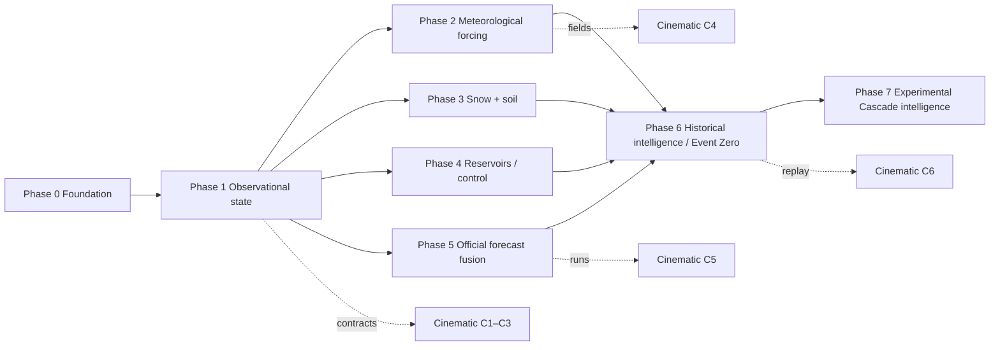

# ROADMAP — technically coherent phases for the platform

Phases are ordered by dependency, not by visual payoff. Each phase has exit criteria that are
tests or artifacts, not adjectives. Sizes are relative (S/M/L/XL); there are no dates. The
cinematic client has its own sequence in [CINEMATIC_ROADMAP.md](CINEMATIC_ROADMAP.md),
pinned to these backend phases.

## Phase 0 — Foundation (L) · *delivered in part by this document set*

Goal: an engineering base that every later phase extends without rewrite.

- Docs: this set (`HYDROLOGY`, `DATA_DOCTRINE`, `DOMAIN_MODEL`, `ARCHITECTURE`,
  `DATA_SOURCES`, `TESTING`, cinematic set, ADR-0001…0013). **Done 2026-08-22.**
- Repo: ICM routing, `v1/` preserved, skills installed. **Done.**
- Workspace: `uv` workspace with `packages/{contracts,core,geo,hydrology,providers,history,visualization}`
  and `apps/{api,worker}`; lint/type/test tooling; import-linter boundaries.
- Schema: Alembic migrations implementing `DOMAIN_MODEL.md` (geography, sources, values,
  intelligence, history); partitioning; roles; append-only grants.
- Basin model: WBD/NLDI-derived polygons for the six seed basins; hypsometry from 3DEP;
  reach topology from NHDPlus HR/NWM; display LOD geometries.
- Provider interface: `Provider` protocol (fetch → archive → parse → normalize) with
  fixtures and a canary per provider; rate-limit and circuit-breaker primitives.
- Ingestion architecture: scheduler + PostgreSQL-backed queue (ADR-0003), job idempotency,
  provider health model, freshness metrics.
- Observability: structured logs, metrics endpoint, tracing hooks; dev `docker compose`
  (postgis, seaweedfs, api, worker).
- Deterministic fixtures: saved payloads for USGS IV + OGC, NWPS gauge + stageflow, AWDB.

Exit criteria: `pytest` green with zero network; `alembic upgrade head` on a fresh PostGIS;
canaries runnable separately and non-blocking; `import-linter` passes; a worker can run a
USGS job end-to-end against fixtures and write an `Observation` with full provenance.

## Phase 1 — Observational state (M)

Goal: durable river truth for the six basins, served basin-centrically.

- USGS stage/discharge with qualifiers, revisions, datums — **on the new OGC API**
  (`api.waterdata.usgs.gov/ogcapi/v0`, API key; ~50 req/h anonymous vs 1,000/h keyed). The legacy
  `waterservices.usgs.gov/nwis/iv` service is scheduled for decommission in Q1 2027 with possible
  intentional degradation from August 2026 (FACT, `docs/research/hydrology-observations-and-official-forecasts.json`);
  the spike's legacy adapter is a stop-gap and must be replaced before Phase 1 exits.
- NWPS gauge metadata, official thresholds (stage **and flow**), `upstreamLid/downstreamLid`,
  `reachId`, crests, impacts, datums — versioned.
- NWPS official forecasts (`/stageflow`) stored as `ForecastRun`/`ForecastValue` (this is
  the first official forecast in the system; Phase 5 adds the rest).
- Derived: observed category (official thresholds only), rate of rise (1/3/6 h), stage and
  flow headroom, time-to-threshold indicator, streamflow percentile against stored history
  (labeled with period).
- API: geography, station/basin state, series, thresholds, alerts (NWS API), `as_of` replay
  on every read endpoint, SSE notifications.
- Web: the spike (CINEMATIC_ROADMAP) consumes these.

Exit criteria: 30 days of continuous ingestion with freshness SLOs met; replay of any past
hour reproduces the state shown at that hour (golden test); contract tests for
`RiverVisualizationState` and `BasinVisualizationState` pass; Green/White categories computed
from flow thresholds.

## Phase 2 — Meteorological forcing (L)

- NWS API alerts/products; NBM and HRRR grids (QPF, temperature, freezing level); GFS/GEFS
  for IVT; WPC QPF; MRMS QPE (observed) with 1–72 h windows.
- Grid pipeline: archive → extract → clip → basin masks → basin aggregates; COG/tile
  derivatives for the client.
- Derived: basin QPF per window with spread, precipitation intensity/duration, AR presence
  and scale, forcing assessment per horizon.
- Exit: basin QPF for all seed basins every model cycle; `WeatherVisualizationState` served;
  grid retention policy active; forcing assessment explained with drivers.

## Phase 3 — Snow + soil state (L)

- SNOTEL (hourly/daily WTEQ, SNWD, PREC, TOBS, SMS/STO) with median/percent-of-median;
  SNODAS daily grids; MODIS/VIIRS snow-covered area; SMAP L4 root-zone; NWM land outputs.
- Hypsometry ∩ snow level → rain-exposed basin fraction; ∩ SCA → rain-on-snow exposed
  fraction; SWE anomaly; API/antecedent indices; soil saturation percentile (fused, with
  disagreement).
- Susceptibility assessment (EXPERIMENTAL index) with drivers.
- Exit: the two snow fractions computed per basin per forecast cycle with provenance;
  susceptibility index served and badged EXPERIMENTAL; fusion disagreement visible.

## Phase 4 — Reservoir / control system (M)

- USACE CWMS (Howard Hanson, Mud Mountain); operator feeds for Skagit (SCL), Baker (PSE),
  Chester Morse/Tolt (SPU) where machine-accessible (otherwise documented as web-only);
  NID, NLD (levees) static data; regulation class on reaches.
- Reservoir state, flood-buffer capacity, inflow/outflow trend; regulated-reach awareness in
  headroom and explanation.
- Exit: `ReservoirVisualizationState` for all machine-accessible reservoirs; headroom on
  regulated reaches carries the regulation flag; levee geometry served with NLD attributes.

## Phase 5 — Official forecast fusion (L)

- NWM short/medium-range (deterministic + ensemble) and analysis; **NWPS HEFS API** ensembles
  (experimental; MEFP-forced, 45 members, 6-hourly to 30 days, daily 12Z, 137 WA locations,
  ~10-day retention — archived daily from Phase 1 onward so Phase 5 has history; FACT,
  `docs/research/hydrology-observations-and-official-forecasts.json`); forecast runs stored
  with supersession. HEFS exceedance quantiles are displayed as **official probabilities**
  (DATA_DOCTRINE §9(a)), which moves official probabilistic guidance out of Phase 7.
- Model agreement assessment (crest magnitude/timing/category) with explanation; forecast
  evolution queries; skill bookkeeping per basin/regime begins.
- Exit: agreement assessment served; forecast-evolution endpoint returns runs vs observed
  outcome for any past valid time; no averaging of disagreeing models anywhere.

## Phase 6 — Historical intelligence / Event Zero (XL)

- Event database; Event Zero (December 2025) reconstruction: backfill observations (USGS
  approved + peaks), NWPS crests/impacts, forecast runs where archived, NWS products,
  grids (MRMS/HRRR/NBM/GFS archives), SNODAS/SNOTEL, reservoir operations, official
  warnings timeline, outcomes — each with publication time for `available_at`.
- Hindcast harness: replay assessments at clock times through the event with
  `as_known_at`; evaluation metrics; forecast-evolution and disagreement views over the event.
- Historical percentiles and analog search (by basin state + forcing signature).
- Exit: a hindcast report for Event Zero with look-ahead bias audit; replay endpoint
  reproduces the event; analog search returns ranked historical events with evidence.

## Phase 7 — Experimental Cascade intelligence (XL)

- Calibrated susceptibility model; regime-conditional bias and skill comparison of official
  vs NWM; threshold-crossing probabilities **only** after hindcast evaluation publishes
  reliability; interpretable contribution analysis feeding the explanation layer.
- Exit: ADR documenting the method, evaluation report, reliability diagram; probabilities
  badged with the method version; a kill-switch that reverts to indices if drift is detected.

## Phase 8 — Advanced visualization (XL; mostly the cinematic C7–C8)

- Basin maps, river network, terrain, precipitation/snow/freezing-level overlays, Event
  Mode, presentation mode — all from the same contracts.

## Cross-cutting workstreams (continuous)

- **Data sources**: each new provider lands with `DATA_SOURCES.md` row, adapter, fixtures,
  canary, health metrics, retention rule.
- **Testing**: hierarchy in `TESTING.md`; coverage thresholds per package; golden replays.
- **Security**: vibesec checklist per PR; dependency audit; secret scanning.
- **Provenance UX**: layer inspector and badges in every new surface.

## Explicit rejections (from V1 or the brief) and why

- Proprietary ML forecasting before Phase 7 — no evaluation basis (ADR-0008).
- Request-driven ingestion — breaks continuity and abuse resistance.
- Hard-coded per-variable contracts — schema churn (ADR-0005).
- Audio, theater narration, TTS — not in MVP; never a channel for critical state.
- Kubernetes/microservices/brokers — no measured need.

## What would change this roadmap

- (Resolved 2026-08-22) NWRFC HEFS ensembles *are* machine-accessible via the NWPS HEFS API;
  official probabilities are now Phase 5 scope. Its experimental status and ~10-day retention
  are the residual risks — archive from day one.
- Operator data (SCL/PSE/SPU) turning out to be web-only would shrink Phase 4 to USACE +
  static and move operator reservoirs to "documented UNKNOWN".
- Event Zero archive gaps (e.g. no archived NWPS forecast runs) would convert parts of
  Phase 6 into "reconstructed from products, flagged backfilled" per ADR-0010.
