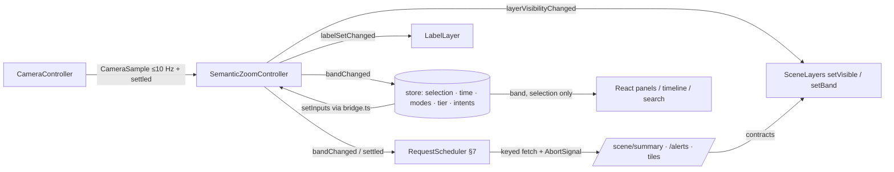

# SEMANTIC ZOOM — altitude bands, meaning, labels, loading, interaction

Canonical design as of 2026-08-22. Owner module: `apps/web/src/scene/SemanticZoomController`.
Consumes [VISUALIZATION_CONTRACTS.md](VISUALIZATION_CONTRACTS.md); bound by the renderer boundary
([adr/ADR-0007](adr/ADR-0007-renderer-boundary-and-visualization-contracts.md) and
[cesium-react-boundary.md](../.claude/skills/react-quality/references/cesium-react-boundary.md)).
Siblings, all on disk and linked where a dependency occurs:
[VISUAL_TRUTH_DOCTRINE.md](VISUAL_TRUTH_DOCTRINE.md) (truth classes and registers this document
may not relax), [CINEMATIC_ARCHITECTURE.md](CINEMATIC_ARCHITECTURE.md) §4 (controllers, query
keys), [CAMERA_SYSTEM.md](CAMERA_SYSTEM.md) (camera state, framing, deep links),
[LAYER_SYSTEM.md](LAYER_SYSTEM.md) §4–6 (visibility resolver, LOD, loading),
[PERFORMANCE.md](PERFORMANCE.md) §4, §12 (loading caps, mobile),
[CINEMATIC_ROADMAP.md](CINEMATIC_ROADMAP.md) §1 (vocabulary). The set was written concurrently
on 2026-08-22; where a sibling and this document disagree, §14 records it for the same-day
reconciliation [CONTEXT.md](CONTEXT.md) requires.

## 0. The one rule, and the invariants that bind every band

Semantic zoom means altitude selects **which question the scene answers**, not how large the same
answer is drawn. From orbit the scene answers "which basins are primed and what is arriving"; from
a river it answers "what is this gauge doing against its official thresholds". `basin:skagit`
exists at every band; its label text, its visible children and the contracts fetched for it change
by band. Geometry LOD also changes, but that is the least interesting part.

Invariants at every band ([DATA_DOCTRINE.md](DATA_DOCTRINE.md) §12, [HYDROLOGY.md](HYDROLOGY.md)
§13, ADR-0007):

1. Every scientific element carries its `source_kind` badge and `truth` class; zooming never drops
   a badge, and a label that cannot fit its badge is not shown.
2. OBSERVED, OFFICIAL_FORECAST, MODELED, DERIVED and EXPERIMENTAL stay distinct in labels and
   layers. `VisualTruthClass` is the key the `styles/` module maps; no colour, material, CSS or
   camera instruction comes from a contract, and none is prescribed here.
3. Cinematic effects — crossfades, auto-orbit, atmospheric glow, water shimmer — are class
   `cinematic` ([VISUAL_TRUTH_DOCTRINE.md](VISUAL_TRUTH_DOCTRINE.md) §1.1 class E), carry no data
   meaning, and are named as such wherever they appear.
4. The client computes nothing hydrologic: band-dependent content is *selection among contract
   fields*; a value the contract lacks is an OPEN QUESTION for the contract, not client arithmetic.
5. UNKNOWN and STALE render as such — never calm, never hidden, never "zoomed away"; a stale
   critical hazard keeps its priority. Nothing asserts depth, inundation, "safe" or "will hold".
6. Camera changes never trigger scientific recomputation; they change which documents are requested.

## 1. Bands and hysteresis

```
effective height above terrain      band                   SceneSummary `band`
 1000 km ─┐ (clamped above)
          │ ORBITAL / REGIONAL        orbital                orbital
  100 km ─┤  enter below  88 km · leave above 112 km
          │ STATE / MULTI-BASIN       state                  state
   30 km ─┤  enter below 26.4 km · leave above 33.6 km
          │ BASIN                     basin                  basin
    5 km ─┤  enter below 4.4 km · leave above 5.6 km
          │ RIVER SYSTEM              river                  river
    1 km ─┤  enter below 880 m · leave above 1,120 m
          │ LOCAL                     local                  local
   75 m  ─┤  enter below  66 m · leave above 84 m
          │ GROUND / IMMERSIVE        ground                 local   (§14 OQ-1)
    0 m  ─┘
```

- Boundaries (100 km, 30 km, 5 km, 1 km, 75 m) are ASSUMPTIONs tuned for Washington: Cascadia
  fills a 16:9 viewport at roughly 600–900 km, a HUC8 basin at 15–30 km, a forecast-point reach at
  2–3 km. GROUND's 75 m sits inside the brief's 50–100 m range. They live in `scene/bands.ts` only.
- Hysteresis is multiplicative, ±12 % of the boundary (ASSUMPTION; retune from telemetry), because
  bands are logarithmic. Enter and exit thresholds differ so a camera resting on a boundary never
  flickers. On `qualityTier = low` and on phones, ground is disabled and collapses into local (§11, §12).
- **Height above terrain, not ellipsoid.** Cascade terrain exceeds 4 km; a camera 3 km above the
  ellipsoid over a ridge may be 500 m above ground. `CameraController` supplies a terrain sample;
  until one exists the controller uses ellipsoid height flagged `approximate` and re-derives on
  the first sample.
- **Pitch widens the view.** `effectiveHeight = heightAboveTerrain / clamp(sin|pitch|, 0.34, 1)`:
  pitch −90° (straight down) ⇒ ×1; −30° ⇒ ×2; shallower than −20° ⇒ ×2.94, clamped (ASSUMPTION:
  the clamp keeps near-horizon views from jumping two bands).

## 2. Band specifications

Each band lists: visible entity types · scientific layers (with truth class) · explicitly not
shown · label content and priority · contracts requested (`SceneSummary` band plus companions) ·
transitions in and out. Layer ids refer to the matrix in §4. The canonical label class order is
P0 selected > P1 critical hazard > P2 major basin > P3 river > P4 city > P5 gauge > P6 secondary
(§6); each band lists the classes it admits in the order it applies them. River, local and ground
place the gauge above the community because the gauge is that band's subject (§14 OQ-11).

### 2.1 ORBITAL / REGIONAL (~100–1000 km)

- **Question:** which basins are primed, what is arriving, who has issued what.
- **Entities:** Cascadia outline and coastline (cartographic); seed basins as whole polygons
  (`geometry_ref.lod = regional`); the AR corridor object; official alert areas.
- **Scientific layers:** major atmospheric systems and major precipitation patterns
  (`WeatherVisualizationState` fields `ivt`, `qpf_6h` — `authoritative_model`; `qpe_1h` —
  `observation`); atmospheric-river corridors from `ar` (present, scale, orientation —
  `authoritative_model`); regional basin susceptibility from
  `HazardVisualizationState.items[].susceptibility_state` (`cascade_derived`, EXPERIMENTAL badge;
  the item carries no `prov` today — §14 OQ-7);
  major official alerts (OFFICIAL).
- **Explicitly NOT:** individual gauges, small tributaries, levees, local infrastructure,
  subbasins, reservoirs, snow points, thresholds.
- **Labels (budget 8):** P1 critical hazard (official category ≥ moderate, or an alert at the top
  severity levels as issued) > P2 major basin (`name` + susceptibility state + EXPERIMENTAL) > P6
  region name. No river, city or gauge labels.
- **Contracts:** `SceneSummary band=orbital` → `HazardVisualizationState` +
  `WeatherVisualizationState` (scope `region:cascadia`); `/alerts` for the extent for alert
  headlines (`HazardVisualizationState` carries only `alerts_count`; §14 OQ-2).
- **Transitions:** entering from above is a clamp. Leaving downward at 88 km: hazard-summary items
  hand over to per-basin `BasinVisualizationState` polygons; the AR corridor persists through
  state and is reduced at basin (§4). Crossfade ≤ 400 ms (cinematic; 0 ms under reduced motion). State values are never
  interpolated — only element visibility fades.

### 2.2 STATE / MULTI-BASIN (~30–100 km)

- **Question:** how do the basins compare, and where is the storm going.
- **Entities:** major watershed boundaries (`lod = state`); major rivers (stream order ≥ 5,
  ASSUMPTION); large reservoirs (those with a non-null `flood_control` block in `ReservoirVisualizationState`;
  ASSUMPTION — the contract shows the block but does not say it is nullable);
  cities (`place:census:*` above a configured population, ASSUMPTION); AR corridor; alert areas.
- **Scientific layers:** basin susceptibility and hazard per basin (`BasinVisualizationState.surfaces`);
  snow coverage (`SnowVisualizationState.sca_raster_ref` — `authoritative_model`); regional QPF
  (`WeatherVisualizationState.basin_aggregates` and `qpf_*` fields); forecast storm path rendered
  as the time sequence of forecast `ivt` fields and `ar.orientation_deg` across valid times,
  labeled with `time.model` — no invented track line (§14 OQ-3).
- **Explicitly NOT:** gauges, subbasins, minor tributaries, levees, snow points, thresholds,
  per-reach state.
- **Labels (budget 14):** P0 selected > P1 critical hazard > P2 major basin (name + susceptibility
  + hazard official category when not `none`) > P3 major river > P4 city > P6 reservoir name.
- **Contracts:** `SceneSummary band=state` → `BasinVisualizationState[]` for the extent,
  `WeatherVisualizationState` (region), `SnowVisualizationState` (raster ref only),
  `ReservoirVisualizationState[]` (large), `/alerts`.
- **Transitions:** down at 26.4 km: the basin nearest the view centre (or the selected basin)
  becomes the *focus basin*; its subbasins, stations and reservoirs load (§7, P0/P1); other basins
  keep state content but lose labels except P1. Up at 112 km: per-basin polygons collapse into the
  hazard summary; the focus basin stays on the history stack for "back" (§8).

### 2.3 BASIN (~5–30 km)

- **Question:** why is this basin primed — state, forcing, and the drivers behind them.
- **Entities:** the focus basin and its subbasins (`lod = basin`, `parent_basin_id` tree);
  tributaries (stream order ≥ 3, ASSUMPTION); reservoirs and dams; gauges (stream, snow, soil,
  reservoir stations); forecast points; alert areas.
- **Scientific layers:** precipitation field (basin-scope `WeatherVisualizationState` fields —
  `observation` for QPE, `authoritative_model` for QPF); snow level
  (`SnowVisualizationState.snow_level`, drawn as the contract elevation against terrain) and
  freezing level (`WeatherVisualizationState.fields[]` variable `freezing_level`,
  `authoritative_model`), kept distinct (HYDROLOGY §7); `rain_exposed_fraction` and
  `rain_on_snow_exposed_fraction` come from the contract, never from client terrain sampling;
  snowpack (`swe.by_band` and SNOTEL `points[]`, model and observation
  kept distinct); soil state (from `headline_drivers` such as `soil_saturation_percentile`;
  §14 OQ-4); river state per gauge (`RiverVisualizationState.observed_category`,
  `flow_visual_intensity`); reservoirs and dams (`ReservoirVisualizationState`); basin-derived
  features (`surfaces`, `tension`, `delta`, `headline_drivers`).
- **Explicitly NOT:** levees, buildings, floodplain polygons, per-reach thresholds, neighbouring
  basins' subbasins (neighbours stay at state LOD).
- **Labels (budget 18):** P0 selected > P1 critical hazard (forecast point ≥ moderate; reservoir
  whose buffer is UNKNOWN during an alert) > P2 focus basin (name + top-ranked drivers, §3) > P3
  major tributary > P4 city > P5 gauge (name; plus observed category when not `none`) > P6
  subbasin / reservoir name.
- **Contracts:** `SceneSummary band=basin` for the focus basin only → `BasinVisualizationState`
  (basin + subbasins), `RiverVisualizationState[]`, `SnowVisualizationState`,
  `ReservoirVisualizationState[]`, basin-scope `WeatherVisualizationState`; explanation payload on
  demand (`/basins/{id}/explanation`).
- **Transitions:** down at 4.4 km: basin-scale fields fade out (cinematic; values stay cached) and
  reach-level state fades in; focus narrows to the *focus reach* — nearest the view centre or the
  selected gauge's reach. Up at 33.6 km: subbasins merge into the parent; gauge labels drop; the
  drivers line collapses to the susceptibility state.

### 2.4 RIVER SYSTEM (~1–5 km)

- **Question:** what is the river doing, where is the water going, what are the thresholds.
- **Entities:** river reaches (`reach:*` at full flowline LOD); gauges and forecast points;
  reservoirs; levees and other `FloodDefense` geometry (Phase 4); communities (`place:*`);
  floodplain polygons only where an authoritative dataset is configured (cartographic; absence is
  shown as "no authoritative floodplain data", never as dry land).
- **Scientific layers:** reach state (`observed_category`, `flow_visual_intensity` — a documented
  display hint, not depth); discharge direction from reach topology `from_node → to_node`
  (cartographic arrow, never a velocity); upstream/downstream topology
  (`RiverVisualizationState.topology`); flood thresholds at forecast points (`thresholds` with
  `basis`, `unit`, `datum`); reservoirs (pool, buffer, flows, trend); levees with NLD attributes
  verbatim; the regulation flag beside headroom on regulated reaches (HYDROLOGY §9).
- **Explicitly NOT:** other basins; regional weather fields (basin aggregates remain in the
  panel); buildings; canopy.
- **Labels (budget 22):** P0 selected > P1 critical hazard (forecast point ≥ moderate, official
  crest ≥ minor, or alert) > P2 river name > P3 forecast point / gauge with stage, flow, trend and
  headroom (§3) > P4 community > P5 reservoir / levee name > P6 reach id (hover only).
- **Contracts:** `SceneSummary band=river` → `RiverVisualizationState[]` for the extent,
  `ReservoirVisualizationState[]`, static geography (`/basins/{id}/reaches`, levee and place
  geometry by ETag), floodplain tiles where configured.
- **Transitions:** down at 880 m: topology highlighting and reach state fade; terrain detail and
  infrastructure rise in priority; focus becomes a *focus point* (gauge, levee, dam, or the terrain
  point under the view centre). Up at 5.6 km: thresholds and levee labels drop; reaches simplify.

### 2.5 LOCAL (~50 m–1 km)

- **Question:** what is physically here — channel, gauge, levee, bridge, road.
- **Entities:** detailed terrain (3DEP where available); roads and buildings where the basemap
  supports them; levees, floodwalls, bridges; the river channel; the gauge location and its datum
  reference; local flood infrastructure; high-resolution imagery or LiDAR-derived surfaces where
  available — all cartographic.
- **Scientific layers:** the gauge's `observed` stage/flow with datum and freshness; its
  `thresholds`; levee `design_height` verbatim ("a design height is a design height"); reservoir
  outlet works where the operator publishes them.
- **Explicitly NOT:** any water-surface elevation, depth or extent derived from stage
  (HYDROLOGY §13); basin surfaces; weather rasters; other gauges' state.
- **Labels (budget 16):** P0 selected > P1 critical hazard at this point > P2 gauge (full river
  content) > P3 levee / bridge / dam with its authoritative attribute > P4 community > P5 road >
  P6 reach id.
- **Contracts:** `SceneSummary band=local` → `RiverVisualizationState` for gauges in the extent
  (typically 0–2), `ReservoirVisualizationState` if present; static geometry and imagery/LiDAR
  tile references via the tile redirect family.
- **Transitions:** down at 66 m: the camera becomes terrain-locked (orbit about the focus point)
  and the ground label set applies. Up at 1,120 m: infrastructure labels drop; reach state returns.

### 2.6 GROUND / IMMERSIVE (below ~50–100 m; boundary 75 m)

- **Question:** what does this place look like at human scale.
- **Entities / layers:** detailed canopy and high-resolution terrain where tile sources exist
  (cartographic); the local water surface at the *mapped channel extent* (cartographic; its shimmer
  is cinematic; it is never a stage-derived surface); infrastructure; localized scientific overlays
  limited to the focus point's `observed` value, thresholds and datum marker.
- **Graceful degradation:** each element declares its dataset; when the dataset is absent for the
  extent the element is omitted and the layer inspector shows "not available here" — never a
  synthetic stand-in.
- **Explicitly NOT:** anything not anchored within ~1 km of the focus point; basin or weather
  layers; labels of entities out of view.
- **Labels (budget 8):** P0 selected > P1 critical hazard at the focus point > P2 gauge > P3
  infrastructure > P4 community. No river, basin or city labels beyond the focus.
- **Contracts:** requests `SceneSummary band=local` (the enum has no `ground`; §14 OQ-1). No
  additional science is fetched; all of it is cached from local.
- **Transitions:** up at 84 m: terrain lock releases; local labels return. Ground is never the
  target of a fly-to (search and selection stop at local); the user descends into it.

## 3. Worked example — the Skagit at three altitudes

Same entity, three bands, three meanings. Values are the fixture examples in
[VISUALIZATION_CONTRACTS.md](VISUALIZATION_CONTRACTS.md) §2–3, not live data.

```
ORBITAL / STATE   (state: BasinVisualizationState.surfaces.susceptibility, official_alerts;
                   orbital: HazardVisualizationState.items[] — no name/prov/truth today, §14 OQ-7)
  SKAGIT — HIGH SUSCEPTIBILITY  [EXPERIMENTAL · 41 min]     Flood Watch [OFFICIAL · NWS Seattle]

BASIN             (BasinVisualizationState.headline_drivers in rank order; SnowVisualizationState)
  SKAGIT BASIN
    soil saturation 94th pct          [DERIVED · inputs SMAP L4 + NWM · 3 h]
    river state elevated               [DERIVED · percentile of USGS observed · 14 min]
    snow level 2,100 m, valid 12:00Z   [MODELED · NBM · issued 06:00Z]      (no trend: §14 OQ-5)

RIVER / LOCAL     (RiverVisualizationState for fp:nwps:MVEW1 / station:usgs:12200500)
  SKAGIT RIVER AT MT VERNON   MVEW1 · USGS 12200500
    stage 10.6 ft (NGVD29) · 6,670 cfs                                 [OBSERVED · USGS · 14 min]
    rising 0.12 ft/h over 6 h · headroom 17.4 ft to minor (stage)       [DERIVED · from observed + official thresholds]
    below ACTION 23.5 ft · minor 28 · moderate 30 · major 32          [OFFICIAL · NWPS]
    official forecast crest 11.1 ft, category none                     [OFFICIAL · NWRFC · issued 06:30Z]
    upstream CONW1 · regulated by Ross, Baker                           [topology · regulation]
```

Rules visible here: each line has exactly one badge derived from its `prov.source_kind` plus
freshness age (a percentile, trend or headroom Cascade computes is DERIVED even when its input is
observed, DATA_DOCTRINE §2; observed and derived never share a line, VISUAL_TRUTH_DOCTRINE §2);
the basin line is rendered from `headline_drivers` in the backend's rank order (the
client does not choose which driver matters); no line says "will flood" or prints a Cascade
probability; the datum appears wherever stage appears (DATA_DOCTRINE §6–7; the Mount Vernon datum
mismatch is the V1 lesson in [V1_AUDIT.md](V1_AUDIT.md) §4.5); the regulation flag accompanies
headroom on a regulated reach (HYDROLOGY §9).

## 4. Layer visibility matrix

`●` visible at full band LOD · `◐` visible, reduced (coarser LOD or raster ref only) · `·` hidden.
User intent (§8 layer toggle) is ANDed with this matrix; a layer the user turned on that is
ineligible at the band shows as "hidden at this altitude" in the inspector.

| Layer id | truth | orbital | state | basin | river | local | ground |
|---|---|---|---|---|---|---|---|
| `terrain`, `imagery` | cartographic | ◐ | ◐ | ● | ● | ● | ● |
| `cascadia_context` (coast, region) | cartographic | ● | ◐ | · | · | · | · |
| `watershed_boundaries` | cartographic | ◐ regional | ● state | ● basin+sub | ◐ | · | · |
| `atmosphere_ivt` | authoritative_model | ● | ● | · | · | · | · |
| `ar_corridor` | authoritative_model | ● | ● | ◐ | · | · | · |
| `precip_field` (QPE obs / QPF model, separate) | observation / authoritative_model | ● coarse | ● | ● basin scope | · | · | · |
| `basin_susceptibility` (EXPERIMENTAL) | cascade_derived | ● | ● | ● focus | · | · | · |
| `hazard_summary` | authoritative_model + cascade_derived | ● | ◐ | · | · | · | · |
| `official_alerts` | official | ● major | ● | ● | ● | ● | ◐ |
| `snow_cover` (SCA raster) | authoritative_model | · | ● | ● | · | · | · |
| `snow_level`, `snow_points` | authoritative_model / observation | · | · | ● | ◐ | · | · |
| `soil_state` | cascade_derived (from drivers) | · | · | ● | · | · | · |
| `rivers` | cartographic + observation state | ◐ major | ● major | ● trib ≥ 3 | ● reaches | ● channel | ● channel |
| `gauges` | observation | · | · | ● | ● | ● | ● focus |
| `thresholds` | official | · | · | · | ● | ● | ● focus |
| `topology_arrows` | cartographic | · | · | · | ● | ◐ | · |
| `reservoirs` | observation / cascade_derived | · | ◐ large | ● | ● | ● | ◐ |
| `levees` | cartographic (NLD verbatim) | · | · | · | ● | ● | ● |
| `communities` | cartographic | · | ◐ cities | ◐ | ● | ● | ◐ |
| `floodplain` (authoritative only) | cartographic | · | · | · | ● | ● | ◐ |
| `roads_buildings`, `lidar`, `canopy` | cartographic | · | · | · | · | ● where supported | ● where supported |
| `water_surface_local` | cartographic + cinematic | · | · | · | · | ◐ | ● |

The matrix is data (`scene/layerMatrix.ts`), not code inside layers; tests snapshot it (§13).
Quality tier, viewport and modes modify it only through the override rows in §12.

## 5. SemanticZoomController

A plain TypeScript class in `scene/`, constructed once by `SceneController`, holding no renderer
types. It is the *only* module that converts camera geometry into meaning.

```ts
// scene/SemanticZoomController.ts — our module; no third-party types cross this interface
export type Band = 'orbital' | 'state' | 'basin' | 'river' | 'local' | 'ground';
export type DataBand = Exclude<Band, 'ground'>;            // SceneSummary enum (§14 OQ-1)

export interface CameraSample {
  heightAboveTerrainM: number; approximate: boolean;       // approximate ⇒ ellipsoid fallback
  pitchDeg: number;                                        // −90 straight down … 0 horizon
  viewCenter: { lon: number; lat: number } | null;         // null when looking at sky
  bbox: [w: number, s: number, e: number, n: number];      // visible extent, clipped to service extent
  verticalVelocityMps: number;                             // sign predicts the next band (§7)
  settled: boolean;                                        // from CameraController 'settled'
}

export interface ZoomInputs {                              // semantic values only (store state)
  selectedEntityId: EntityId | null;
  focus: { basinId?: EntityId; reachId?: EntityId; pointId?: EntityId };
  eventMode: { active: boolean; eventId?: EntityId };   presentationMode: boolean;
  qualityTier: 'ultra' | 'high' | 'balanced' | 'low';   reducedMotion: boolean;
  viewportClass: 'desktop' | 'tablet' | 'phone';        layerIntents: Record<LayerId, boolean>;
  time: { valid: string; asOf: string | null };
}

export interface BandChanged            { prev: Band; next: Band; cause: 'descend' | 'ascend' | 'jump' | 'tier' | 'viewport'; effectiveHeightM: number }
export interface LayerVisibilityChanged { band: Band; visible: LayerId[]; hidden: LayerId[]; lod: Record<LayerId, LodKey> }
export interface LabelSetChanged        { band: Band; budget: number; labels: LabelSpec[] }    // §6
export interface LabelSpec              { entityId: EntityId; level: 0 | 1 | 2 | 3 | 4 | 5 | 6; anchor: { lon: number; lat: number };
                                          lines: { text: string; badge: string | null }[]; clusterCount?: number }  // badge = prov.source_kind + age

export interface SemanticZoomController {
  onCameraSample(s: CameraSample): void;                   // throttled ≤ 10 Hz while moving, plus on settle
  setInputs(i: ZoomInputs): void;                          // called from scene/bridge.ts only
  readonly band: Band;
  on(e: 'bandChanged', h: (x: BandChanged) => void): Unsubscribe;
  on(e: 'layerVisibilityChanged', h: (x: LayerVisibilityChanged) => void): Unsubscribe;
  on(e: 'labelSetChanged', h: (x: LabelSetChanged) => void): Unsubscribe;
}
```

Band derivation (pure functions, exported for tests):

```ts
export function deriveBand(prev: Band, effectiveHeightM: number, cfg: BandConfig): Band {
  // cfg.boundaries = [100e3, 30e3, 5e3, 1e3, 75]  (tops of state, basin, river, local, ground)
  // cfg.hysteresis = 0.12; cfg.groundEnabled derived from tier and viewport
  let band = prev;
  while (band !== lowest(cfg) && effectiveHeightM < boundaryBelow(band, cfg) * (1 - cfg.hysteresis)) band = below(band);
  while (band !== 'orbital'   && effectiveHeightM > boundaryAbove(band, cfg) * (1 + cfg.hysteresis)) band = above(band);
  return band;
}
export const effectiveHeight = (h: number, pitchDeg: number) =>
  h / Math.min(1, Math.max(0.34, Math.sin(Math.abs(pitchDeg) * Math.PI / 180)));
```

- **Emission discipline.** `bandChanged` fires only when the derived band differs; a multi-band
  jump (search fly-to, deep link) emits one event with `cause: 'jump'`. `layerVisibilityChanged`
  follows every `bandChanged` and every change of tier, viewport, mode or layer intent.
  `labelSetChanged` fires on band change, on settle, on selection change, and at ≤ 4 Hz while the
  camera moves (label re-evaluation is cheap; fetches are not).
- **Layer subscription.** `SceneController` subscribes each `SceneLayer` once:
  `layerVisibilityChanged` → `layer.setVisible(visible.includes(id))`; layers with band-dependent
  LOD implement the optional `setBand?(band, lod)` (additive to the `SceneLayer` interface in the
  boundary doc). Layers never read the camera.
- **Request keying.** Every scene-triggered request is keyed
  `['scene', dataBand, extentKey, t, asOf, layersHash]`. `extentKey` is the bbox snapped to a
  band-specific grid plus one-cell margin (ASSUMPTION: 2°, 0.5°, 0.1°, 0.02°, 0.005° for
  orbital…local) so ordinary panning re-keys rarely; orbital always uses the fixed Cascadia extent so
  its document is shared and ETag-cacheable. Basin-band requests for the focus basin are keyed by
  `focus.basinId`, not bbox. `t` is the store time; `asOf` the replay clock. The key shape and the
  scheduler's name differ across siblings (§14 OQ-10).
- **Cancellation on band change.** Each key owns an `AbortSignal`. `bandChanged` aborts every
  in-flight request under the previous `dataBand` prefix; a time change aborts the previous `t`; a
  selection change aborts the previous selection's P1 requests (§7). A late response for a key no
  longer current is discarded by key equality, never applied.
- **Live updates.** SSE topics are subscribed for the basins in the current extent (all seed
  basins at orbital/state); an event refetches the current key only ([ARCHITECTURE.md](ARCHITECTURE.md) §6).
- **No camera-altitude checks in React.** Components read `band` (and nothing about height) from
  the store; the store never holds height, pitch or bbox; `components/**` may not import from
  `camera/**` or `scene/**` (lint restricted-imports rule; review checklist). A component that
  needs altitude-dependent behaviour asks for a *semantic* flag the controller publishes.



## 6. Label system

Labels are scene objects owned by `layers/labels/`, fed by `labelSetChanged`. They are not React
elements and never screen-fixed; every label has a geographic anchor.

- **Anchoring.** Polygons anchor at a precomputed interior point carried with `display_geom_lod`
  (ASSUMPTION: the backend materializes it with the LOD geometry; centroid fallback); reaches at the flowline mid-point; stations, dams and reservoirs at their
  `geom`; alerts at the centroid of their area. A label moves with the terrain, not the viewport.
- **Priority levels.** Canonical order P0 selected > P1 critical hazard > P2 major basin > P3 river
  > P4 city > P5 gauge > P6 secondary (subbasin, reservoir, reach id, road); §2 gives the order each
  band applies (§14 OQ-11). Within a level, ties break by the contract's `display.label_priority`
  where it exists (today only `BasinVisualizationState`), then by stable id order.
- **Altitude thresholds.** Each label class has an eligible band set (§2); outside it the class is
  not a candidate regardless of budget.
- **Budget and declutter.** Per-band budgets 8/14/18/22/16/8 (×0.75 on `low`; ×0.6 in
  presentation mode; phone and tablet budgets in §11). Resolution: sort candidates by priority;
  accept while budget remains and the projected anchor is ≥ 28 px (ASSUMPTION) from every accepted
  anchor; when over budget, drop the lowest *class* whole rather than a random subset.
- **Clustering.** Same-class candidates whose anchors project within the spacing threshold merge
  into the highest-priority member with a count ("+3 gauges"); a cluster has one anchor and
  expands on hover or on descending one band.
- **Fading.** A label appears only after being eligible on two consecutive evaluations and, once
  shown, dwells ≥ 800 ms unless the band or selection changes (label-level hysteresis). Opacity
  ramps of 250 ms are cinematic; under reduced motion they are instant.
- **Occlusion awareness.** Anchors behind terrain (depth test supplied by `SceneController`) are
  hidden; anchors beyond the horizon at shallow pitch fade; the screen rectangle under the docked
  panel is excluded from placement; label-on-label overlap is resolved by priority, never jitter.
- **Selection context.** The selected entity's label is P0, expanded to the full band template
  (§3), never clustered; its `topology.upstream/downstream` neighbours are boosted one level at
  river band. Hover produces a transient tooltip that does not count against the budget and never
  displaces a placed label.
- **No label soup.** Budget, spacing, class-level dropping and hysteresis are all mandatory; a
  frame never shows more labels than the band budget and two labels never overlap. Visual
  regression scenes (§13) assert counts per band.

## 7. Progressive loading

The `RequestScheduler` orders work in five priority classes; a lower class never delays a higher
one, and the queue is re-planned on `bandChanged`, `settled`, selection change and time change.

| Priority | What | Key | Cancelled when |
|---|---|---|---|
| P0 | `SceneSummary` for the camera-visible extent at the current band | band + extentKey + t + asOf | band changes; extentKey changes; t changes |
| P1 | Selected / focus basin: `Basin`, `River`, `Snow`, `Reservoir` states in full; explanation on demand | focus.basinId + t + asOf | selection or focus changes (previous basin's P1 aborted) |
| P2 | Near-camera geometry: LOD vector tiles for the extent (watersheds, reaches, levees, places) | lod + tile id | band changes two steps; tile leaves extent |
| P3 | Active scientific layers' raster refs (`precip_field`, `snow_cover`, `atmosphere_ivt`) | raster_ref + t | layer hidden by matrix or intent; t changes |
| P4 | Likely next destination: next-lower band's P0 for the view centre when `verticalVelocityMps < 0`; the hovered search result's framing extent; the next event-timeline entry in Event Mode | same keys as P0/P1 | always abortable; dropped first under pressure; bounded by [PERFORMANCE.md](PERFORMANCE.md) §4.5 and [LAYER_SYSTEM.md](LAYER_SYSTEM.md) §6.4 (idle-only, capped, off on `low` and phones) |

Renderer-native terrain and imagery streaming is the scene's own concern and is budgeted in
[PERFORMANCE.md](PERFORMANCE.md) §4.3. Prefetched documents are cached under their own keys, so
ascending back to a previous band is served from cache. A slow P0 shows a loading state on the
layer; the previous band's document may remain on screen as what it is (the retained slice,
[LAYER_SYSTEM.md](LAYER_SYSTEM.md) §6.2) but is never relabelled as the new band's content.

## 8. Interaction semantics per band

| Gesture | orbital | state | basin | river | local / ground |
|---|---|---|---|---|---|
| hover | basin tooltip: name, susceptibility + EXPERIMENTAL, alert headline | + hazard official category, forcing state | subbasin/gauge tooltip: latest value, badge, age | reach tooltip + upstream/downstream highlight; gauge: stage/flow/trend | infrastructure attribute verbatim (e.g. NLD design height) |
| click / select | basin | basin, reservoir, city | subbasin, gauge, reservoir, dam | gauge, reach, reservoir, levee, community | gauge, levee, dam, bridge |
| double-click / focus | fly to basin band on that basin | same | fly to river band on that gauge/reach | fly to local band on that point | orbit lock on that point |
| scroll / zoom | height changes → §1 hysteresis; a band change re-plans P0 at once (§7); extent-only changes fetch on `settled` | same | same | same | below 66 m enters ground (if enabled) |
| drag | pan | pan | pan | pan; orbit with modifier | orbit about the focus point (terrain-locked) |
| timeline scrub | sets `time`; layers `setTime`; requests re-key on `t`; intermediate `t` requests coalesce (only the latest in flight); band unaffected | | | | |
| layer toggle | sets intent; visibility = intent ∧ matrix; inspector shows "hidden at this altitude" when the matrix vetoes | | | | |
| search | §9 — flies to the result's home band | | | | |
| back / previous context | pops the previous context — [CAMERA_SYSTEM.md](CAMERA_SYSTEM.md) §3.2's pose history (`restorePrevious()`) with the store's `{entityId, time, asOf}` at that pose; restores by fly (cut under reduced motion) and re-selects; mirrored to the deep-link grammar of CAMERA_SYSTEM §7 (`sel`, `cam`, `t`, `as_of`, `layers`; the band is implied by `cam`) so the browser back button does the same | | | | |

**Selection pipeline** (identical at every band; `scene/bridge.ts` is the only subscriber):

1. `selectedEntityId` is set in the store (semantic id, e.g. `fp:nwps:MVEW1`).
2. `CameraController.frame(entity)` flies to the entity's *home band* — basin, subbasin → basin;
   reach, gauge, forecast point, reservoir, community → river; dam, levee, bridge → local;
   historical event → state over the union of its basins (this table and
   [CAMERA_SYSTEM.md](CAMERA_SYSTEM.md) §5.1 disagree on communities and dams: §14 OQ-8). The
   framing pose is CAMERA_SYSTEM §5.1's bounding-sphere fit with per-band pitch and padding; the
   requirement added here is that its effective height re-derives to the home band with at least
   the hysteresis margin (≈ the band's log-midpoint), so small user adjustments do not cross a
   threshold. The flight is a terrain-following path (cinematic; duration per CAMERA_SYSTEM §4.3;
   reduced motion ⇒ cut); a new selection mid-flight interrupts it.
3. Visual emphasis through `layers/*/style.ts` only (selected flag in the style call).
4. Context panel (React, docked, non-modal) reads the store and queries the entity's state,
   assessments and provenance; badges and freshness on every value.
5. Timeline scoped to the entity: series and forecast runs for a forecast point, assessment history
   for a basin, pool and flows for a reservoir, the event timeline for an event.
6. Related information — `topology.upstream/downstream`, `regulation.regulated_by`, `regulates`,
   `protects_area_id`, `downstream_of_reach_ids` — rendered as links that run this same pipeline.
7. **No unrelated modal windows.** Nothing in the viewer opens a modal; the only overlays are the
   docked panel, the layer inspector and the search palette, all dismissible with Escape and all
   keyboard-reachable ([TESTING.md](TESTING.md) §6 accessibility path).

## 9. Global search as geographic navigation

- Index: basins, rivers (named reach groups), cities (`place:census:*`), gauges (`station:*`,
  `fp:nwps:*`), reservoirs, dams, levee systems, historical events (`event:*`). Served by
  `/search?q=` with typed results carrying entity id, bbox and home band (a requirement this
  document places on the route [ARCHITECTURE.md](ARCHITECTURE.md) §6 lists); the client never
  searches renderer entities.
- Selecting a result runs the selection pipeline (§8): the camera flies to the home band, the
  entity is selected, the panel and timeline follow. Hovering a result prefetches at P4.
- A historical event result additionally sets `time.mode = past`, `asOf` to the event's first
  timeline entry, enters Event Mode (§10), frames the union of `basins[]` at state band and opens
  the event timeline; everything shown then obeys knowledge time (DATA_DOCTRINE §11).
- Search never lands at ground, never changes layer intents, and mutates time only for events.
- Keyboard: shortcut opens, arrows move, Enter selects, Escape closes; the E2E scenario "search
  Skagit → camera flies or cuts → basin selected" is the gate.

## 10. Event Mode and Presentation Mode

**Event Mode** (live event focus or replay of an `event:*`; Phase 6 backend). Band thresholds and
hysteresis are unchanged; content and priority change. In both modes the camera path is the tour
of [CAMERA_SYSTEM.md](CAMERA_SYSTEM.md) §10 (ordered stops, each with a band, layer set and dwell;
Event Mode keyframes bound to timeline entries); the rows here are what this controller changes at
a stop's band:

| Band | Event Mode adjustment |
|---|---|
| orbital | hazard summary restricted to the event's basins; AR corridor and `qpe_1h` history at the replay clock; alert issuance on the timeline; label budget tilts to P1 |
| state | official alerts as first-class labels with issue time; storm path plays as the sequence of forecast runs available at `asOf` (superseded runs stay distinct, never merged) |
| basin | forecast evolution: each run a separate timeline item; explanation deltas between assessments; the drivers line shows `delta` since the previous assessment |
| river | crest markers: observed crest (OBSERVED, with revision flag), official forecast crests per run (OFFICIAL_FORECAST), model crests (MODELED) — three distinct classes, never averaged; reservoir actions from `EventTimelineEntry` |
| local / ground | levee incidents and evacuation entries from the event timeline, verbatim with source url; no reconstruction of water extent |

The replay clock drives `asOf`; a band change during replay never moves the clock. A value with
`available_at > asOf` is absent by construction (`as_known_at`), shown as "not yet known at this
time", not as a gap.

**Presentation Mode** (briefings, large displays) changes density and pacing only — never which
values or badges are shown. Label budget ×0.6 applies at every band (§6):

| Band | Presentation Mode adjustment |
|---|---|
| orbital / state | label budget ×0.6, larger label scale; slow auto-orbit about the region (cinematic; off under reduced motion); inspector chrome hidden, badges kept |
| basin | auto-orbit about the focus basin (cinematic); drivers line limited to the top two ranks; panel collapsed to a headline strip with badges |
| river | threshold ladder always visible for the selected point; topology highlights persist without hover |
| local / ground | no auto-orbit (disorienting at human scale); label budget ×0.6 |

## 11. Mobile and tablet reductions

Mobile-first layout is a non-goal through Phase 2 ([ARCHITECTURE.md](ARCHITECTURE.md) §11); the
reductions below are the controller's `viewportClass` overrides so nothing is designed out. Core
intelligence — panel, timeline, provenance — works at every class.

| Band | tablet | phone |
|---|---|---|
| orbital | budget 8; `atmosphere_ivt` ◐ | budget 4; `atmosphere_ivt` hidden unless intent |
| state | budget 10; cities ◐ | budget 6; no city labels; `snow_cover` ◐ |
| basin | budget 12; subbasin labels off | budget 8; tributaries ≥ order 4; `soil_state` in panel only |
| river | budget 14 | budget 8; topology arrows on selection only |
| local | budget 10; `roads_buildings` where supported | budget 6; `lidar` off |
| ground | enabled on `high` / `ultra` only — unreachable while [PERFORMANCE.md](PERFORMANCE.md) §12 caps tablets at `balanced`, so in practice disabled | disabled (collapses into local) |

Touch: tap = select; long-press = hover tooltip; pinch = zoom (height); two-finger drag =
tilt/orbit; the panel becomes a bottom sheet that never covers the selected label's anchor (the
excluded placement rectangle tracks the sheet). Pitch is limited to within 30° of nadir on phones
(`pitchDeg ≤ −60°`, ASSUMPTION) so effective height inflates by at most ×1.16 (§1) and cannot lift
the band on its own.

## 12. Quality tier, reduced motion, and override composition

- `low`: ground disabled; raster fields at half resolution; label budgets ×0.75; 2.5D terrain;
  `water_surface_local` and atmospheric glow off (cinematic only); every panel and badge intact
  (boundary rule 8). `balanced`: ground enabled, `canopy` off. `high` / `ultra`: full matrix.
- Reduced motion: every fly-to is a cut; crossfades and label fades are instant; auto-orbit is off;
  band changes and label sets are otherwise identical, so tests run both paths on one fixture.
- Overrides are data rows beside the matrix (`scene/overrides.ts`):
  `{ when: tier | viewportClass | eventMode | presentationMode, layer, band, visibility | budgetFactor }`,
  composed in a fixed order — matrix → tier → viewport → event → presentation → user intent — so the
  result is a pure function of inputs and is snapshot-tested.

## 13. Tests (deterministic; vitest; no renderer instantiated)

All controller tests feed `CameraSample` and `ZoomInputs` objects; none create a viewer.

| Area | Tests |
|---|---|
| band math | table-driven `deriveBand` at every boundary ± hysteresis and exactly on it; clamping above 1000 km and below 0 m; `effectiveHeight` at pitch −90 / −45 / −30 / −20 / −5 |
| hysteresis | a height sequence oscillating ±5 % around each boundary never changes band; crossing by > 12 % changes exactly once; property test: for any monotone height sequence the band sequence is monotone (no A→B→A) |
| multi-band jumps | 800 km → 2 km emits one `bandChanged` with `cause: 'jump'`; tier change to `low` at 40 m emits `cause: 'tier'` to local |
| label priority resolution | fixture candidates with projected positions and budget N: output deterministic and ordered; selected always present; clusters form below 28 px; over budget drops the lowest class whole; two consecutive evaluations required; dwell respected; ties by `label_priority` then id |
| layer visibility matrix | snapshot of matrix × tier × viewport × event × presentation × intent; property: a layer is never visible outside its eligible bands; `low` never enables cinematic-only layers; a vetoed intent reports "hidden at this altitude" |
| request keys | `extentKey` stable for sub-cell pans and distinct across cells; keys differ across band, `t`, `asOf`; the orbital key is constant |
| cancellation | fake fetch with `AbortSignal`: band change aborts the previous band's P0/P3; selection change aborts the previous P1; a late response for a stale key is discarded |
| selection pipeline | home-band table; the framing pose's effective height re-derives to the home band with ≥ 12 % margin to both boundaries |
| E2E / visual ([TESTING.md](TESTING.md) §6) | fixture contracts, fixed clock and camera per band: label count ≤ budget, zero overlaps, a badge on every label line; search → fly/cut → select; the reduced-motion path; a degraded source shows STALE at every band |

## 14. Open questions

- **OQ-0 (from the spike, 2026-08-22).** The spike retuned the band boundaries to 900/450/90/8 km of
  effective height (`apps/web/src/scene/bands.ts`) because framing a whole seed basin (the Skagit is
  ~150 km across) needs a ~300 km camera range, which §1's 100/30/5/1 km would classify as orbital.
  ASSUMPTION either way; C1 telemetry decides, and §1 is updated when it does.

- **OQ-1.** `SceneSummary.band` enumerates `orbital/state/basin/river/local`; this document defines
  a sixth client band `ground` that requests `band=local`. Proposal: add `ground` as an additive
  minor-version value so the backend may trim science to the focus point.
- **OQ-2.** `HazardVisualizationState.items[]` carries `alerts_count` only; orbital alert labels
  need `event` and `severity`. Either the client fetches `/alerts` for the extent (assumed here) or
  an additive `top_alert {event, severity, prov}` is added.
- **OQ-3.** No "storm track" product exists in [VISUALIZATION_CONTRACTS.md](VISUALIZATION_CONTRACTS.md);
  "forecast storm path" is rendered as the time sequence of forecast `ivt` fields and
  `ar.orientation_deg`, labeled with the model. An authoritative AR or storm-track product, if one
  is published, enters as OFFICIAL_FORECAST or MODELED, never as a client construction.
- **OQ-4.** There is no `SoilVisualizationState`; basin-band soil state renders from
  `headline_drivers` (`soil_saturation_percentile`). A dedicated contract would let the soil layer
  show per-source percentiles and their disagreement (HYDROLOGY §8).
- **OQ-5.** `SnowVisualizationState.snow_level` has no direction. "snow level rising" in §3 needs
  an additive `snow_level.trend: rising|falling|steady|unknown` with its window and `prov`; until
  then the basin label shows elevation and valid time only.
- **OQ-6.** Boundary, hysteresis, spacing and budget constants are ASSUMPTIONs;
  [CAMERA_SYSTEM.md](CAMERA_SYSTEM.md) §12 and [PERFORMANCE.md](PERFORMANCE.md) §9 own the
  telemetry that retunes them against the frame budgets measured in the SPIKE and C1
  ([CINEMATIC_ROADMAP.md](CINEMATIC_ROADMAP.md) §5–6).
- **OQ-7.** OPEN QUESTION: `HazardVisualizationState.items[]` carries `basin_id`, states and
  `alerts_count` but no `name`, `prov` or `truth` (VISUALIZATION_CONTRACTS §7 against §10 rule 1),
  so the orbital label in §3 cannot print its EXPERIMENTAL badge and age from that document alone.
  Either items gain `prov` (additive) or orbital labels read `BasinVisualizationState` at `regional` LOD.
- **OQ-8.** OPEN QUESTION: home bands disagree — §8 sends communities to river and dams to local;
  [CAMERA_SYSTEM.md](CAMERA_SYSTEM.md) §5.1 sends `place:*`/`area:*` to local and
  `reservoir:*`/`dam:*` to river. One table must own this; the framing rule of §8 step 2 holds
  under either.
- **OQ-9.** DECIDED 2026-08-22: this document's model is canonical — `CameraController` emits
  `cameraSample`; `SemanticZoomController` derives the band (`deriveBand` + `effectiveHeight`,
  hysteresis) and emits `bandChanged` / `layerVisibilityChanged`. CINEMATIC_ARCHITECTURE.md §4.1/§17,
  CAMERA_SYSTEM.md §3/§13 and PERFORMANCE.md §4.2 now say the same.
- **OQ-10.** DECIDED 2026-08-22: request keys are `['scene', dataBand, extentKey, tBucket, asOf, layersHash]`, owned by `api/keys.ts`; the scheduler is `scene/requests.ts` (`RequestScheduler`). CINEMATIC_ARCHITECTURE.md §4.3/§17 adopt this shape.
- **OQ-11.** OPEN QUESTION: the canonical class order (§6) puts city above gauge, but §2.4–2.6 put
  the gauge above the community at river, local and ground because the gauge is the band's subject.
  Decide whether the canonical order is band-relative (this document's practice) or the bands conform.
